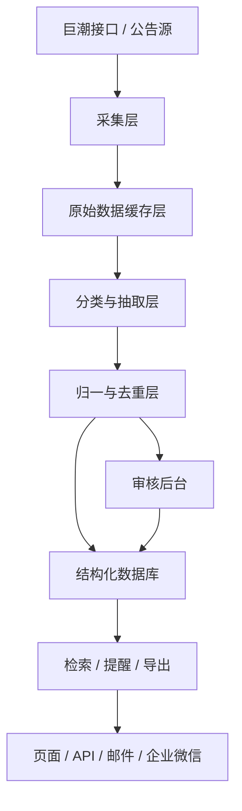

# 中国上市公司高管与董事变动情报系统

## 1. 文档定位

这份文档是当前项目的唯一主文档。

它的目标不是记录零散想法，而是作为整个项目的统一设计源：

- 解释项目为什么存在
- 定义阶段目标和范围边界
- 固化需求分析、功能设计和技术路线
- 给后续代码开发提供唯一上位依据
- 替代过去分散的多份产品、技术、阶段、商业化说明

从现在开始，这个项目的设计、需求、阶段规划、技术路线，原则上都应该先收敛到这份文档里，再进入实现。

## 2. 当前项目结论

### 2.1 项目本质

这个项目的本质不是资讯站，不是综合金融终端，也不是公告聚合网站。

它应该被定义为：

**一个面向中国 A 股市场的“高管与董事变动情报系统”，把分散公告和当前领导层信息转成可监控、可检索、可导出、可提醒的结构化数据产品。**

### 2.2 当前阶段

项目当前不是从 0 开始。

目前已经有：

- A 股上市公司全集基础库
- 当前高管基线同步能力
- 公司库、人物库、覆盖台账、详情页
- 基础 API
- 部分同步治理能力

当前数据库状态：

- 公司总数：6100
- 活跃公司：5697
- 已同步公司：5032
- 失败公司：921
- 待同步公司：147
- 当前快照：50112
- 人物数：54527

说明：

- `6100` 是当前项目维护的公司全集总数，不等于当前仍在上市的 A 股活跃家数
- 当前夜间基线同步实际使用的是 `5697` 家活跃上市公司候选池
- 该候选池已排除明显退市代码、`PT` 历史代码，以及北交所旧 `4`/`8` 字头旧代码

这说明当前项目已经进入：

**“基线产品底座已形成，但事件流与商业化工作流仍未完成”的阶段。**

### 2.3 当前最关键判断

现在这个项目最重要的事，不是继续分散加页面，也不是继续堆文档，而是：

**把它从‘可运行的基线系统’推进成‘可卖的第一阶段产品’。**

## 3. 项目要解决的问题

### 3.1 真实问题

目标用户并不缺公告，他们缺的是：

- 更早知道谁离职、谁上任
- 更快判断某家公司当前领导层结构
- 更快找到某个人历史任职和流动路径
- 更快形成可执行的候选名单

当前市场的主要问题不是“没有数据”，而是：

- 数据分散
- 人工整理成本高
- 更新不连续
- 人物信息无法形成统一视图
- 公告看得见，但不能直接转成工作流

### 3.2 当前状态为什么痛

目标用户现在常见的工作方式是：

- 手工扫公告
- 用现成终端做低效拼接
- 维护 Excel 或内部名单
- 靠微信、邮件、群消息做人肉变动同步

也就是说，他们现在有替代方案，但替代方案又慢又碎。

### 3.3 项目要提供的核心价值

这个项目最终要卖的不是“数据库”，而是下面这 4 个价值：

1. 更早发现上市公司高管和董事变动
2. 更快形成结构化人物与公司视图
3. 更快做出候选名单
4. 更低成本地持续监控重点公司与重点人物

## 4. 目标用户与第一目标市场

### 4.1 第一目标用户

第一阶段只聚焦这类用户：

- 猎头顾问
- 董事会搜寻顾问
- 高端人才咨询团队

### 4.2 为什么先做这类用户

因为这类用户同时满足：

- 痛点强
- 决策快
- 付费意愿高于散户
- 对“提醒 + 检索 + 导出”的价值感知直接
- 不要求你一上来就变成全功能金融终端

### 4.3 第一目标用户的关键工作流

他们的典型动作不是“来看新闻”，而是：

1. 发现某类高管刚离职或刚上任
2. 判断是否值得跟进
3. 查这个人以前在哪
4. 查这家公司近期还有哪些高层变化
5. 导出相关人物名单
6. 建立后续监控

所以产品必须围绕这个流程设计。

### 4.4 第一阶段成交方式

第一阶段不要幻想靠“自助注册后自然转化”就完成商业闭环。

更现实的成交方式应该是：

- 你亲自演示
- 先给种子客户开试用账号
- 用系统 + 半人工服务一起交付
- 用真实搜寻项目去验证提醒、检索、导出是否真有价值

也就是说，阶段一卖的不只是软件，而是：

**“高管人事动态 + 候选名单初筛 + 持续监控” 的轻交付服务。**

## 5. 产品定义

### 5.1 一句话定义

**一个面向猎头与董事会搜寻顾问的 A 股高管人事动态产品。**

### 5.2 阶段一产品名

建议阶段一对外表述为：

**上市公司高管人事动态**

### 5.3 用户看到的产品承诺

阶段一应该明确承诺：

- 每天帮你盯住 A 股核心高管和董事变动
- 让你快速查看公司当前领导层与人物历史轨迹
- 帮你把变动结果一键导出为候选名单

### 5.4 阶段一不承诺的事

- 不承诺替代 Wind
- 不承诺做全市场金融终端
- 不承诺覆盖全部岗位和全部资本市场
- 不承诺复杂图谱第一天就成熟

### 5.5 第一阶段对外展示焦点

内部数据覆盖可以更宽，但对外展示必须更聚焦。

第一阶段首页、榜单页、提醒页的主视图，优先突出：

- 董事长变动
- 总经理 / 总裁 / CEO 等价角色变动
- CFO / 财务负责人变动

董事、独立董事不从产品里删除，但更适合放在：

- 公司详情页
- 人物详情页
- 高级筛选结果
- 深度导出结果

这样做的原因很简单：

- 这些角色对搜寻顾问价值最高
- 用户最容易在几秒内理解产品价值
- 首页不会被低信号噪音稀释

## 6. 范围边界

### 6.1 市场范围

- 只做 A 股
- 覆盖沪市、深市、北交所
- 不做港股
- 不做美股中概

### 6.2 角色范围

- 董事长
- 总经理 / 总裁 / CEO 等价角色
- CFO / 财务负责人 / 财务总监
- 董事
- 独立董事

### 6.3 事件范围

- 任命
- 辞职
- 离任
- 换届连任
- 代行职责
- 提名通过但未生效

### 6.4 第一阶段必须做的功能

1. 今日 / 本周人事动态
2. 公司检索
3. 人物检索
4. 公司详情页
5. 人物详情页
6. 关注列表
7. 邮件 / 企业微信提醒
8. CSV 导出
9. 覆盖台账
10. 审核后台

### 6.5 第一阶段明确不做

- 复杂图谱首页
- 宏观和财务分析平台
- 全量 API 商业开放
- 复杂企业组织权限模型
- 大型 BI 中台

### 6.6 内部覆盖范围与对外主卖点的区分

这里必须刻意区分两层：

内部数据层：

- 可以继续保留董事与独立董事
- 可以继续积累更多角色和更多事件类型

对外商业层：

- 首页主榜单只优先突出董事长 / CEO 等价 / CFO 等价
- 提醒模板优先围绕高价值角色设计
- 销售演示优先讲“变动发现、人物轨迹、名单导出”

这个区分非常重要。

否则产品会在内部视角上越做越全，但对外价值表达越来越散。

## 7. 产品结构

### 7.1 首页

首页不是介绍页，而是工作页。

必须承载：

- 今日变动
- 本周变动
- 热门角色变动
- 我的关注摘要
- 快速筛选入口

### 7.2 人事动态页

这是第一阶段最核心的页面之一。

必须支持：

- 时间范围筛选
- 角色筛选
- 事件类型筛选
- 行业筛选
- 公司筛选
- 导出

### 7.3 公司页

必须回答 3 个问题：

- 这家公司现在是谁在任
- 最近发生了哪些关键变动
- 当前领导层是否稳定

### 7.4 人物页

必须回答 4 个问题：

- 这个人是谁
- 当前在哪任职
- 过去在哪任职
- 最近有什么变动

### 7.5 公司库与人物库

这两页承担的是检索入口，不是展示页。

它们必须让用户快速缩小范围，而不是只展示静态数据。

### 7.6 关注页

关注页要让用户形成复访。

至少支持：

- 我关注的公司
- 我关注的人
- 我关注的角色
- 最近提醒记录

### 7.7 审核后台

审核后台不是运营锦上添花，而是阶段一必须有的“可信度控制器”。

它至少要能处理：

- 低置信度事件
- 同一公告下多个候选事件的聚合审核
- 人物归一问题
- 失败同步公司
- 人工重跑

审核后台的产品口径必须按公告聚合，而不是按底层待审记录平铺。原因是同一篇公告可能同时涉及董事长、董事、财务负责人、副总经理等多个人员和职位，底层需要保留事件级 `ReviewQueue` 精度，但运营人员看到的工作单元应该是一篇公告。公告卡片内再展开候选事件、证据句、置信度、缺失字段和单项操作。

该口径可以同时满足两个目标：

- 避免 `/review` 页面被同一公告重复刷屏，降低人工审核噪音。
- 保留单个人员/角色/事件类型的审核精度，避免整篇公告只能粗暴通过或驳回。

### 7.8 统一页面状态设计

这部分现在必须写死，不然后面 UI 和实现会越做越乱。

每个核心页面默认都必须定义 5 种状态：

- 加载中
- 空结果
- 部分成功
- 失败
- 正常完成

每条关键变动、快照、人物结果都尽量展示 3 类可信度信号：

- 来源
- 时间
- 置信度 / 是否人工复核

阶段一先不追求花哨视觉，但必须做到：

- 桌面端优先
- 移动端至少可读、可筛、可打开详情
- 关键操作按钮位置稳定
- 列表页和详情页的交互规则一致

## 8. 用户工作流设计

### 工作流 A：发现高管离任

1. 打开人事动态
2. 筛选 CFO / 总经理 / 董事长
3. 查看辞职 / 离任类事件
4. 进入人物页查看历史任职
5. 导出名单

### 工作流 B：做行业搜寻项目

1. 搜行业相关公司
2. 筛选近 90 天变动
3. 打开公司和人物详情
4. 收藏关注
5. 导出项目初始名单

### 工作流 C：持续监控重点公司

1. 关注重点公司
2. 设置提醒
3. 收到变化通知
4. 返回公司页确认上下文

## 9. 核心模块拆分

### 模块 1：公司与人物基线库

职责：

- 公司全集
- 当前领导层快照
- 当前人物库

状态：

- 已有基础实现

下一步重点：

- 提高覆盖率
- 优化失败重试
- 稳定基线质量

### 模块 2：公告原始层

职责：

- 公告列表抓取
- 原始文本 / 正文缓存
- 来源追踪

状态：

- 还未形成完整链路

### 模块 3：事件抽取层

职责：

- 管理层相关公告分类
- 结构化事件抽取
- 证据片段回写

状态：

- 表结构已有
- 业务链路未落地

### 模块 4：检索与详情层

职责：

- 公司检索
- 人物检索
- 公司详情
- 人物详情

状态：

- 已经有初版
- 但还需要正式接入事件流

### 模块 5：导出与名单层

职责：

- 条件筛选
- CSV 导出
- 候选名单保存

状态：

- 还未落地

### 模块 6：关注与提醒层

职责：

- 关注对象管理
- 日报
- 实时提醒

状态：

- 尚未开始

### 模块 7：审核与运维层

职责：

- 低置信度事件审核
- 失败同步重跑
- 数据质量控制

状态：

- 尚未开始

## 10. 数据策略

### 10.1 数据来源

当前已接入：

- 巨潮证券清单
- 巨潮公司简介接口
- 巨潮公司高管接口

阶段一要新增：

- 巨潮公告列表抓取
- 巨潮公告正文或详情缓存

### 10.2 数据层级

阶段一完整数据链应分为 5 层：

1. 公司全集层
2. 当前基线层
3. 原始公告层
4. 结构化事件层
5. 用户工作流层

### 10.3 数据可信策略

必须坚持：

- 每条事件都保留来源链接
- 每条事件都保留证据片段
- 低置信度事件必须可人工审核
- 人物消歧前期宁可保守，不可激进合并

### 10.4 数据新鲜度与可信承诺

阶段一必须给自己一个清晰的数据承诺，不然“实时”“及时”都只是空话。

建议锁定如下内部目标：

- 关注公司基线刷新：1 天内
- 非关注公司基线刷新：7 天内滚动覆盖
- 公告入库延迟目标：30 分钟内
- 结构化事件可见延迟目标：2 小时内
- 低置信度事件进入审核队列：抽取后立即入队

对外表达不要吹“全实时”，而要表达成：

**“高价值变动尽快发现，并且每条结果都能回溯来源。”**

### 10.5 去重、归一与可信度规则

阶段一如果不把这层写死，后面事件流一定会脏。

必须明确：

1. 同一公告中的同一人物 / 同一角色 / 同一事件类型，只允许保留一条标准事件
2. 同一人物事件跨多份公告重复出现时，要按公司、人物、角色、事件类型、生效日期做近似合并
3. 结构化事件必须写入 `confidence`
4. `confidence` 低于阈值时必须进入审核队列，而不是直接展示为高可信结果
5. 人物跨公司同名归一，前期默认保守，不为了“图谱好看”强行合并

## 11. 技术路线

### 11.1 总体技术方向

阶段一继续沿用当前栈：

- Python
- FastAPI
- SQLAlchemy
- SQLite 作为当前本地与早期版本运行库
- Jinja2 先做服务端渲染

理由：

- 当前工程已经在这条栈上
- 单人迭代速度最快
- 文本处理和数据清洗后续更顺
- 现在的瓶颈不是框架性能，而是业务闭环

### 11.2 系统分层



### 11.3 当前技术原则

1. 路由层不写采集逻辑
2. 模板层不写业务规则
3. 事件抽取必须有证据片段
4. 任何图谱能力都建立在结构化事件之上
5. 先做稳的产品主链，不提前做复杂基础设施美化

### 11.4 核心任务状态机

现在项目里最缺的，不是多一个页面，而是把任务状态机定清楚。

阶段一至少要有两条状态机：

基线同步状态机：

- `pending`
- `running`
- `synced`
- `failed`
- `needs_retry`

公告处理状态机：

- `discovered`
- `downloaded`
- `parsed`
- `classified`
- `extracted`
- `review_required`
- `published`
- `failed`

这两条状态机决定了：

- 队列怎么重跑
- 覆盖台账怎么展示
- 审核后台怎么定位问题
- 报警和运维怎么做

### 11.5 存储与迁移触发点

阶段一继续用 SQLite 没问题，但要提前写明何时迁移，不要拖到系统已经乱了再说。

建议触发条件如下：

- 并发写入任务明显增多
- 公告原始层与事件层体量开始持续膨胀
- 需要稳定部署到云端并支持多进程
- 审核后台和提醒任务开始并行运行

一旦满足这些条件，就迁移到 PostgreSQL。

也就是说，SQLite 是阶段一的交付工具，不是长期终局。

## 12. 数据模型规划

### 当前已有核心表

- `companies`
- `persons`
- `executive_snapshots`
- `role_tenures`
- `baseline_runs`
- `source_documents`
- `events`
- `company_metrics_daily`

### 阶段一建议新增逻辑实体

#### `watchlists`

用途：

- 存用户关注公司 / 人物 / 角色

#### `alerts`

用途：

- 存提醒记录与发送状态

#### `review_queue`

用途：

- 存低置信度事件和待人工修订事项

#### `saved_lists`

用途：

- 存用户保存的候选名单或导出配置

#### `sync_jobs`

用途：

- 存基线同步和公告处理任务的状态、错误、重试次数

#### `document_processing_runs`

用途：

- 存单篇公告从发现到发布的处理轨迹

## 13. API 规划

### 已有 API

- `/api/overview`
- `/api/baseline/summary`
- `/api/coverage`
- `/api/companies`
- `/api/companies/{ticker}`
- `/api/people`
- `/api/people/{person_id}`
- `/api/events`
- `/api/rankings/churn`

### 阶段一新增 API

#### 人事动态

- `GET /api/feed/events`
- `GET /api/feed/events/{id}`

#### 关注

- `GET /api/watchlists`
- `POST /api/watchlists`
- `DELETE /api/watchlists/{id}`

#### 提醒

- `GET /api/alerts`

#### 导出

- `POST /api/exports/events`
- `POST /api/exports/people`

#### 审核后台

- `GET /api/review/queue`
- `GET /api/review/groups`
- `POST /api/review/queue/{id}/approve`
- `POST /api/review/queue/{id}/reject`
- `POST /api/review/queue/{id}/reprocess`
- `POST /api/review/documents/{source_document_id}/approve`
- `POST /api/review/documents/{source_document_id}/reject`
- `POST /api/review/documents/{source_document_id}/reprocess`
- `POST /api/review/retry-company/{ticker}`

## 14. 第一阶段迭代顺序

### 里程碑 1：基线收尾

交付：

- 基线覆盖继续补齐
- 失败公司分类
- 覆盖台账稳定
- `needs_retry` 与失败原因归类

### 里程碑 1.5：可卖演示闭环

交付：

- 一套对外演示脚本
- 一套手工交付模板
- 一套标准 CSV 导出样例
- 一套种子客户试用流程

### 里程碑 2：公告原始层

交付：

- 公告列表抓取
- 原始公告落库
- 正文缓存

### 里程碑 3：事件抽取层

交付：

- 人事类公告分类
- 结构化事件落库
- 证据片段保留
- 去重和 `confidence` 规则落地

### 里程碑 4：主工作流完成

交付：

- 人事动态页
- 详情页接事件流
- 导出功能

### 里程碑 5：关注与提醒

交付：

- 关注列表
- 邮件提醒
- 企业微信提醒
- 关注公司优先刷新策略

### 里程碑 6：审核与演示版

交付：

- 审核后台
- 失败重跑入口
- 可对外演示版本
- 异常事件人工复核闭环

## 15. 时间预算

按个人开发者 + AI 辅助开发节奏，阶段一建议预算：

- 第 1-2 周：基线收尾与同步治理
- 第 3 周：可卖演示闭环与种子客户交付准备
- 第 4-5 周：公告原始层与抽取原型
- 第 6 周：人事动态与导出
- 第 7 周：关注与提醒
- 第 8 周：审核后台与演示打磨

目标是：

**8 周左右做出第一版可卖产品。**

## 16. 验收标准

### 产品验收

- 用户能在首页看到当天变动
- 用户能筛出指定角色和事件类型
- 用户能进入公司页和人物页查看上下文
- 用户能导出候选名单
- 用户能关注对象并收到提醒

### 技术验收

- 公告抓取稳定
- 事件能结构化落库
- 失败同步可追踪
- 低置信度事件可审核
- 关键状态机可观测
- 去重策略可验证

### 运营验收

- 能用 1 小时内完成一次对外演示准备
- 能在真实搜寻任务里导出一份可用名单
- 能为种子客户提供至少一轮持续提醒

### 商业验收

- 能对外完整演示
- 能让潜在客户试用
- 能收集第一轮真实付费反馈

## 17. 文档规则

从现在开始，文档体系必须收敛，不再无限分裂。

规则如下：

1. 本项目只有一份主文档：`docs/PROJECT_MASTER_PLAN.md`
2. 任何新的需求分析、功能规划、阶段路线，先更新主文档
3. 旧文档不再继续扩写，统一归入归档目录
4. README 只做入口，不承载重复设计内容
5. 改代码时，如果影响设计、范围、运行方式或阶段状态，必须同步更新主文档和 README

## 18. 最终结论

这个项目接下来不该再以“加一个页面、补一个接口、写一份零散说明”的方式推进。

正确方式已经锁定：

**以这份主文档为统一设计源，围绕‘猎头 / 董事会搜寻顾问的高管人事动态’完成阶段一产品。**

## 19. 第二轮自动审核结论

这次重新用自动审查思路过一遍后，结论不是推翻原方案，而是确认原方向基本正确，但有 5 个必须补强的点：

1. 商业楔子要更窄。
对外主卖点必须优先围绕董事长、CEO 等价角色、CFO 等价角色，不要让董事和独立董事抢走首页主视图。

2. 可信度规则要更硬。
事件流如果没有去重、证据、置信度、人工复核，后面所有提醒和导出都会变脏。

3. 状态机必须前置。
基线同步和公告处理都要有明确状态流，否则覆盖台账、审核后台、重跑机制都会变成手工猜。

4. 第一阶段不是纯软件交付。
应该默认带一层半人工服务，用真实搜寻项目去完成前几单成交和验证。

5. DX 和运维不能等最后补。
本地启动、失败重试、演示准备、样例导出、状态可观测，这些都要在阶段一里提前固化。

最终判断：

- 方向正确，继续做
- 不需要推翻重来
- 但必须按这轮补强后的版本执行，不能再按“有个大方向就开始写页面”那种方式推进

## 20. 市场调研与方向校验报告

报告时间：2026-04-18

### 20.1 调研目标

这轮调研要回答 3 个问题：

1. 这个项目有没有真实市场空间
2. 当前方向是否需要大幅调整
3. 现有设计版本是继续执行，还是应当改成别的产品形态

### 20.2 市场现实

先说结论。

这个赛道不是“没人做”，而是：

- 已有大而全的金融终端
- 已有大而全的企业信息平台
- 但还没有一个面向中国上市公司高管与董事变动、专门服务搜寻顾问工作流的窄而深产品

这就是机会所在。

#### 20.2.1 数据源和监管基础是真实存在的

巨潮资讯不是野路子数据站，而是深交所法定信息披露平台，由深圳证券信息有限公司运营，并且已经发展为覆盖深沪主板、创业板、科创板、北交所、港交所、新三板的多层次信息披露平台。

这意味着：

- 主数据源成立
- 数据权威性成立
- 产品可以建立在公开披露信息之上，而不是灰色爬取逻辑之上

#### 20.2.2 中国上市公司治理正在变得更重、更严

证监会发布的《上市公司独立董事管理办法》自 2023 年 9 月 4 日起施行，明确了独立董事任职资格、职责、履职方式、现场工作要求、法律责任和配套机制。

监管导向已经很清楚：

- 董事会治理更受重视
- 独董履职更受约束
- 董事、高管、审计委员会相关动态更值得被持续追踪

这不是“可有可无的信息”，而是治理基础设施的一部分。

#### 20.2.3 高管与董事变动不是低频噪音

公开市场里，A 股上市公司高管和董事变动本来就高频存在，而且经常与：

- 控股权变化
- 战略调整
- 经营压力
- 监管处罚
- 治理冲突

一起出现。

公开报道里，2026 年 1 月就出现过“高管变动公告 340 份、31 家上市公司董事长辞职”的集中变动现象；2025 年 3 月科创板公司也出现“年内超 120 名董监高离职或变更”的统计。

这说明市场里存在可持续、可跟踪、可筛选的事件流，不是拍脑袋想象出来的需求。

#### 20.2.4 搜寻顾问与董事会搜寻市场客观存在

这个项目的第一用户不是散户，而是高端搜寻与董事会搜寻顾问。

外部行业信息显示，中国猎头行业非常分散，但仍然存在一批以 retained executive search 为核心的高质量机构。AESC 公开材料提到，中国约有 70,000 家 search firms，但其中真正做 retained executive search 的只是“solid core”。

这反而是好事：

- 大市场很碎，不适合一开始铺大众化产品
- 但高价值核心客户群体是存在的
- 他们的工作流足够痛，足够可收费

#### 20.2.5 董事会与 CEO succession 是真实预算项

Spencer Stuart、Russell Reynolds Associates 等全球头部搜寻机构，在中国和大中华区公开强调的服务能力本来就包括：

- Board Director and Chair Search
- CEO Succession
- Board Effectiveness
- Executive Search

这说明“董事会搜寻”“CEO succession”“领导层变动跟踪”不是伪需求，而是成熟顾问行业的长期预算项。

同时，Russell Reynolds 公开数据指出，APAC 在 2025 年上半年 CEO turnover rate 为 7%，略高于全球平均的 6%。

这类变化越明显，围绕领导层变化的情报产品就越有价值。

### 20.3 竞品格局

#### 20.3.1 第一类竞品：大而全金融终端

代表：

- Wind
- 同花顺 iFinD
- 东方财富 Choice

它们的共同特点是：

- 覆盖极广
- 数据很深
- 工具很多
- 面向投研、交易、宏观、量化、资讯、数据库等广泛场景

它们非常强，但也有一个关键问题：

**它们不是围绕“高管变动搜寻工作流”设计的。**

也就是说，这些终端更像“超级仓库”，不是“专门武器”。

我们的机会不在于和它们拼广度，而在于：

- 更早定位高价值变动
- 更快把变动转成公司/人物/名单工作流
- 更适合猎头和董事会搜寻顾问使用

#### 20.3.2 第二类竞品：企业信息与关系图平台

代表：

- 企查查
- 天眼查
- 启信宝一类企业信息平台

这类产品擅长：

- 工商信息
- 股权关系
- 人员任职关系
- 风险信息
- 关系图谱

它们的价值很大，但问题同样明显：

- 不是以上市公司公告事件流为中心
- 不是以高管变动时效为中心
- 不是以“发现候选人 / 形成名单 / 持续监控”为中心

所以它们更像辅助情报工具，而不是我们要做的主产品。

#### 20.3.3 第三类竞品：美国版 TrackSuccession

TrackSuccession 证明了一件非常重要的事：

**只要底层事件流足够稳定，“领导层变动”完全可以被做成一个独立、可结构化、可导出的情报产品。**

它依赖的是 SEC Form 8-K Item 5.02 这种高信噪比统一入口。

中国市场没有等价的单一入口，所以我们不能机械照搬。

但它验证了产品逻辑：

- 不是做新闻
- 不是做研报
- 是做结构化变动信号

### 20.4 机会窗口

综合调研后，这个项目的真正窗口不是“做一个更便宜的 Wind”，而是下面这条缝：

**在中国 A 股市场，用公开披露信息做一个窄而深的领导层变动雷达，把公告和基线数据转成搜寻顾问能直接使用的工作流。**

这个窗口成立的原因有 4 个：

1. 上游数据公开且权威
2. 下游客户痛点具体且高价值
3. 大而全竞品没有专门优化这个工作流
4. 中国治理与独董制度改革让这类信息的重要性继续提高

### 20.5 当前方案哪些地方是对的

调研后确认，当前主方案里这些判断是对的，可以继续保持：

1. 只做 A 股
2. 第一目标用户锁定猎头 / 董事会搜寻顾问
3. 产品核心是“基线 + 事件流 + 检索 + 导出 + 提醒”
4. 第一阶段不做大而全金融终端
5. 先做结构化可信事件，再考虑图谱和更复杂分析

这几条不需要推翻。

### 20.6 当前方案必须调整的地方

不是推翻，而是收口。

#### 20.6.1 对外叙事还要再窄一点

现有方案虽然已经比早期更聚焦，但对外主卖点还要更狠。

第一阶段对外应优先强调：

- 董事长
- CEO 等价角色
- CFO 等价角色

董事、独立董事继续保留在数据层和深度筛选层，但不要让它们主导首页价值表达。

#### 20.6.2 第一阶段本质上是“工具 + 服务”

调研后更明确的一点是：

单靠一个网站首页，很难让第一批客户直接买单。

更现实的成交方式仍然应该是：

- 你亲自演示
- 种子客户试用
- 系统交付 + 半人工名单服务

这部分不是妥协，而是 early-stage 正确打法。

#### 20.6.3 必须把可信度做成产品特征

因为金融终端和企业信息平台都很强，所以你不能只靠“我也有数据”赢。

你必须赢在：

- 每条事件有来源
- 每条事件有证据片段
- 每条事件有置信度
- 可区分是否人工复核

这应该成为产品卖点，而不是后台实现细节。

#### 20.6.4 不要把“关系图”误当作第一卖点

市场会喜欢关系图，但它不是第一单成交的主因。

真正能促成试用和付费的，仍然是：

- 变动发现
- 人物检索
- 公司上下文
- 导出名单
- 持续提醒

关系图更适合放到第二阶段，作为增强价值和内容传播点。

### 20.7 是否需要转向

我的判断是：

**不需要转向。**

当前方向是成立的。

但要避免 4 种错误转向：

1. 转向散户资讯站
2. 转向大而全金融终端
3. 转向先做图谱和可视化秀肌肉
4. 转向多市场同时开工

这些方向都会把你拖进巨头战场，或者把产品做散。

### 20.8 最终结论

综合外部市场调研，我的最终结论是：

1. 项目方向可行
2. 不需要推翻当前设计版本
3. 需要做的是“保持主方向不变，但继续收窄商业楔子和首页表达”
4. 当前主文档版本可以继续作为执行版本
5. 下一步应该按现有主方案推进实现，而不是重新立项

一句话总结：

**这个项目不是方向错了，而是方向对了，但必须始终克制，不能从“高管人事动态”漂回“大而全金融数据平台”。**

### 20.9 调研来源

以下来源用于这轮市场判断：

- TrackSuccession 官方说明页
- 巨潮资讯 / 深圳证券信息官方页面
- 中国证监会《上市公司独立董事管理办法》相关页面
- 中国上市公司协会《2025年上市公司治理情况报告》摘要
- Russell Reynolds Associates 关于 APAC CEO turnover 与中国领导力议题的公开页面
- Spencer Stuart 北京办公室与 CEO succession / board search 相关公开页面
- 同花顺 iFinD 官方站点
- 东方财富 Choice 官方站点与官方应用说明
- Wind 官方终端介绍
- 企查查公开站点

## 21. 当前实现快照

更新时间：2026-04-18

### 21.1 已落地模块

当前代码已经落地的，不再只是基线库，而是：

- 公司全集与当前高管基线同步
- 公司库、人物库、覆盖台账
- 项目记忆库
- 管理层公告抓取与原始公告入库
- 基于公告标题规则的初版事件抽取
- 人事动态页面与事件 API
- 关注列表与提醒流
- 审核队列与审核操作
- CSV 事件导出

### 21.2 当前本地数据状态

当前数据库里已经有：

- 6100 家公司
- 50112 条当前高管快照
- 54527 个人物
- 53 篇原始公告
- 3 条已发布事件
- 3 条待审核条目

这说明：

- 基线层已经稳定存在
- 原始公告层已经打通
- 事件层已经开始有真实数据
- 审核层已经进入工作状态

但也说明：

- 公告正文抽取还没有接入
- 标题规则抽取还比较保守
- 已发布事件数量仍然偏少

### 21.3 当前实现结论

项目现在已经从“只有规划和基线”的阶段，进入了“有真实公告、真实事件、真实审核链路”的阶段。

接下来真正该继续补的，不是再发散做新方向，而是沿着这条既定主链继续增强：

1. 公告正文抽取
2. 标题+正文联合事件抽取
3. 去重和人物归一增强
4. 关注命中的持续提醒策略
5. 导出和名单工作流继续打磨

### 21.4 本轮抽取链路修订

本轮已经把公告处理从“标题粗筛 + 标题抽取”升级为“标题粗筛 + PDF 正文解析 + 正文证据抽取”。

新的执行原则如下：

1. 标题只负责筛出候选公告，不再直接决定事件发布。
2. 系统会先下载 CNINFO PDF，并提取正文文本。
3. 只有正文里同时出现明确的人名、角色、事件类型和证据片段，才允许自动发布。
4. 股权激励、核查意见、公示说明等高噪音公告会优先被排除。
5. 仅有“董事会会议决议公告”这类泛标题时，如果正文没有人事议案，就直接忽略，不再塞满审核队列。
6. 如果正文出现了人事议案线索，但仍无法稳定提取结构化事件，再进入人工审核。

这次修订解决的核心问题是：

- 审核台里充斥“董事会决议公告”但其实没有人事变动的脏文档
- 将股权激励相关文件误发为董事提名事件
- 仅凭标题、没有正文证据就自动发布事件

关于是否必须接入 AI 模型，当前判断是：

- 第一阶段不强依赖 AI 模型
- 先把 PDF 正文规则抽取做稳，优先解决精确率和审核脏队列问题
- 后续只有在规则法对复杂公告召回不足时，才补充 AI 结构化抽取作为增强层，而不是替代主链路
## 22. 正式运营版评估与定稿

更新时间：2026-04-20

### 22.1 先说结论

当前项目已经不再是“只能本地演示的原型”，而是：

**可以正式投入种子运营的顾问版系统。**

这里的“正式运营”定义得很明确：

- 适合你自己或小团队运营
- 适合服务第一批真实客户
- 适合以“系统 + 人工交付”方式成交
- 不等于已经是公开市场上的成熟自助 SaaS

也就是说，当前版本已经可以拿去跑真实业务，但还不该对外包装成“成熟公共金融终端”。

### 22.2 这轮已经补上的关键能力

这轮不是只补了数据，而是把几处真正会影响上线的结构问题一起补掉了：

1. **6100 家公司原始全集已全部同步完成**
   原始公司全集已经做到 `6100/6100` 全量同步，不再停在 5032 家。

2. **北交所旧代码到 920 新代码的映射已接入系统**
   这解决了剩余 76 家北交所公司因为代码切换导致官方接口拉不动的问题。

3. **公司详情与公司库按发行人聚合**
   系统不再简单按单个证券代码展示公司，而是开始按 `org_id` 做发行人聚合，解决了同一家公司因新旧代码并存而被拆成两份的问题。

4. **打包安装已修复**
   `pip install -e .` 之前会因为顶层 `data/` 目录被误判成包而失败，这个问题已经修掉。

5. **后台登录保护已接入**
   通过 `APP_ADMIN_PASSWORD` 和签名 Cookie，可以在正式部署时启用后台登录保护。

6. **上线准备度页面已落地**
   新增 `/launch-readiness` 与 `/api/launch-readiness`，不再需要人工翻日志拼状态。

7. **覆盖率统计口径已修正**
   覆盖台账里的 `coverage_rate` 现在按原始公司全集口径计算，不再出现超过 100% 的假象。

### 22.3 当前真实上线口径

当前系统里需要区分两层口径：

#### 原始公司全集口径

- 总公司记录：`6100`
- 已同步：`6100`

这一层用于保留完整代码全集、历史代码、切换代码与原始同步状态。

#### 发行人去重后的产品口径

- 去重后发行人视图：`5841`
- 去重后零快照公司：`317`
- 活跃零快照发行人：`167`
- 已发布事件：`133`
- 待审核条目：`110`

这一层才是产品真正应该面向用户展示和运营的公司视图。

### 22.4 现在离“大规模外部运营”还差什么

这部分要说实话。当前版本虽然已经可做正式种子运营，但还没到“大范围公开运营”的成熟度。真正的阻塞项有 3 个：

1. **事件流已经起量，但仍未到成熟运营级**
   当前已发布事件已经从 `3` 条提升到 `133` 条，说明历史回填路线成立；但回填还没补完，待审核也还有 `110` 条，仍不足以对外宣传成成熟事件数据库。

2. **去重后仍有 317 家零快照公司**
   这批公司大多是历史代码、旧简称、合并重组遗留或接口无法提供高管快照的记录。其中活跃口径还有 `167` 家，没有清掉前，当前在市公司视图就仍然不够干净。

3. **后台密码保护默认未启用**
   代码已经支持，但如果正式部署时不设置 `APP_ADMIN_PASSWORD`，系统仍然会裸奔。

4. **数据库层仍停留在 SQLite**
   昨晚已经真实出现锁库现象。只要还是 SQLite，这套系统就更适合受控种子运营，不适合长时间后台任务 + Web 并行的正式公网运营。

### 22.5 因此，最终定稿的版本定义

把版本定义收紧，不再模糊：

#### 当前可交付版本

**种子运营版**

适合：

- 你自己运营
- 跑真实种子客户
- 顾问交付
- 内部使用或受控访问

不适合：

- 公开推广给大量外部用户
- 宣称“全量成熟事件数据库”
- 直接当公共金融终端卖

#### 下一个版本目标

**公开运营候选版**

达标条件要锁死：

1. 去重后零快照公司显著下降
2. 事件流发布量稳定提升
3. 默认部署启用后台保护
4. 运营看板可直接判断数据质量

### 22.6 这一轮之后的执行原则

从现在开始，后续开发不能再乱漂，必须遵守这 4 条：

1. 原始公司全集继续保留，但产品展示统一按发行人视图走
2. 北交所代码切换逻辑必须当成系统能力维护，不允许再靠手工补数
3. 先把事件流做厚，再谈公开化和大规模推广
4. 任何会影响上线口径的代码改动，都必须同步更新 README 和本主文档

### 22.7 最终判断

一句话定稿：

**当前版本已经是可正式运营的种子版，不是公开成熟版。下一步不是推翻重做，而是继续沿着发行人去重、事件流增厚、运营安全收口这条线推进。**

## 23. 距离正式上线运营还差什么

更新时间：2026-04-20

这里的“正式上线运营”，指的是：

- 可以稳定挂在公网
- 可以连续运行抓取和回填任务
- 可以让运营人员长期使用
- 可以承受规则变更和日常迭代
- 不靠人工盯库和手工修表维持

如果按这个标准审当前项目，差距已经不是“再补两个页面”，而是 6 个层面的运营化收口。

### 23.1 已经具备的条件

当前已经具备：

- 原始公司全集 `6100/6100` 全量同步
- 发行人聚合视图
- 当前高管基线库
- 公告抓取、PDF 正文解析、规则抽取
- 审核队列、人事动态、导出接口
- 单管理员后台保护代码
- 零快照修复任务、历史回填任务、持续抓取入口

这说明系统已经不是原型，而是一个可以持续迭代的业务底座。

### 23.2 真正阻塞正式运营的 6 个问题

#### 1. 数据库不够运营级

当前仍然使用 SQLite。本地这轮开发里已经真实出现了锁库，表现为：

- Web 进程、零快照修复任务、历史回填任务并行时互相抢锁
- 后台脚本容易因为写锁失败中断
- 夜间任务需要靠“停服务/单进程/清残留进程”这种方式维持

这在种子版能忍，在正式运营版不能忍。

**结论：这是正式上线的硬阻塞项。**

#### 2. 当前在市公司口径还不够干净

虽然零快照公司已经从前一版的 `403` 压到了 `317`，活跃口径也压到 `167`，但剩下这部分已经进入难样本区：

- ST / *ST 疑难公司
- 历史代码残留
- 已并购/更名/吸收合并但仍被识别为活跃的壳记录
- 官方接口本身不给高管快照的边缘记录

这意味着当前公司库已经能用，但“当前在市完整高管库”还没完全收口。

**结论：这是正式上线前必须继续压缩的产品口径问题。**

#### 3. 事件层还不够厚，也还不够稳

事件层已经从 `3` 条拉到了 `133` 条，说明路线没问题。但正式运营要求的不只是“能抽到”，而是：

- 历史窗口要更完整
- 近 30/90/180 天要有稳定密度
- 待审核量要继续下降
- 规则误报要可控

当前待审核还有 `110` 条，说明抽取链路已经可用，但还在密集打磨期。

**结论：这是正式上线前的第二大硬门槛。**

#### 4. 权限模型还是单管理员模式

当前系统只有一层简单的后台登录保护，本质上是：

- 一个管理员密码
- 一个签名 Cookie
- 没有多角色
- 没有运营权限分级
- 没有“谁审核了什么”的审计闭环

这足够你自己运营，不足够团队化运营。

**结论：种子运营够用，正式运营不够。**

#### 5. 提醒链路还停留在站内能力

当前仓库里已经有 `watchlists` 和 `alerts`，但真实库里这两个表还是 `0`，说明：

- 站内关注与提醒结构已经存在
- 但还没有被真实运营数据打通
- 也还没形成对外送达闭环

换句话说，当前更像“可运营后台”，还不是“成熟情报订阅产品”。

**结论：这不是上线第一阻塞，但它直接影响收费能力。**

#### 6. 缺少自动化测试和运维保护

当前仓库里没有正式的项目级测试体系。对正式运营来说，这意味着：

- 抽取规则一改，可能伤到老数据
- 同步逻辑一改，可能重新引入锁库和口径漂移
- 没有回归测试兜底
- 没有系统级健康检查、备份恢复、失败重试的完整运维闭环

**结论：这是把系统从“能跑”变成“敢持续发版”的最后一道门。**

### 23.3 按优先级收口，真正该先做什么

#### P0，正式上线硬阻塞

1. SQLite 迁移到 PostgreSQL
2. 继续压缩活跃零快照发行人
3. 把历史事件继续回填到可用密度
4. 降低待审核条目，稳定抽取质量
5. 正式部署默认启用后台保护

#### P1，运营稳定性

1. 给任务系统补守护方式和失败重试
2. 做基础健康检查和运行日志看板
3. 给审核链路补审计字段和操作记录
4. 给提醒链路做一次真实闭环验证

#### P2，商业化与规模化

1. 送达型提醒
2. 团队角色权限
3. 更厚的事件历史库
4. API 稳定化

### 23.4 最后定性

把话说死：

- **现在适合种子运营**
- **现在不适合公开成熟运营**
- **距离正式公网运营，差的是运营化和稳定性，不是再补几个页面**

一句话结论：

**项目已经过了“能不能做”的阶段，现在卡在“能不能长期稳定运营”。真正的下一步，是把数据库、事件密度、零快照口径、审核压力和运营安全这五件事收口。**

### 23.5 审核台重复待审项修复与运营口径定稿

更新时间：2026-04-25

#### 23.5.1 问题定义

线上 `/review` 页面出现大量“看起来重复”的待审项。复盘后确认，主要根因不是同一事件被无意义重复写入，而是底层审核队列采用事件级记录：同一篇公告如果抽取出多位候选人、多种角色或多种事件类型，就会生成多条 `ReviewQueue`。旧版审核页按 `ReviewQueue` 逐条展示，导致相同公告标题、相同系统原因和相同候选线索重复出现。

这个问题会直接影响正式运营：

- 人工审核人员无法快速判断到底要审几篇公告。
- 同一公告的多个候选事件上下文被拆散，判断质量下降。
- 审核噪音被误认为数据重复，影响对系统可信度的判断。

#### 23.5.2 定稿口径

正式运营版采用“双层审核模型”：

- 数据层：继续保留事件级 `ReviewQueue`，一个人员 + 一个角色 + 一个事件类型是一条可追溯审核对象。
- 产品层：审核台按 `source_document_id` 聚合，一篇公告是一张审核卡片。
- 操作层：同时支持公告级批量通过/驳回/重抽取，以及候选事件级单项通过/驳回。

该口径是阶段一的固定设计，不再回退到单纯平铺待审项。

#### 23.5.3 已实现内容

- 新增 `list_review_document_groups()`，把待审队列按公告聚合。
- `ReviewQueueItemOut` 增加 `source_document_id`，为前端和 API 提供稳定聚合键。
- 新增公告级接口：`/api/review/groups`、`/api/review/documents/{source_document_id}/approve`、`reject`、`reprocess`。
- `/review` 页面改为公告级审核工作台，集中展示候选事件、证据句、置信度、缺失字段和公告级操作。
- 清理 `notice_pipeline.py` 中已经失效的旧版抽取/重抽取函数，避免后续维护误改旧逻辑。
- 增加单元测试覆盖：同一公告多事件只聚合为一组、整篇公告批量审核会同步更新事件状态。

#### 23.5.4 后续约束

后续任何审核功能开发都必须遵守：

- 页面默认以公告为工作单元，不能重新变成重复的事件平铺列表。
- 自动审核可以减少进入待审的公告，但不能破坏事件级追溯。
- 如果新增 AI 审核、审计日志或权限控制，必须同时支持公告级和事件级两个粒度。

### 23.6 前端列表与人物信息优化定稿

更新时间：2026-04-26

本轮前端优化不按单点页面修补处理，而是统一收口为“运营列表系统 + 人物上下文展示”。

#### 23.6.1 问题定义

阶段一种子运营最常用的页面是人事动态、公司库、人物库、公司详情、人物详情和审核台。此前这些页面已经能用，但存在几个运营问题：

- 列表页只有 `limit/offset` 参数，没有页面分页控件，连续翻页困难。
- 页面只显示总数，不显示当前正在看第几条到第几条。
- 人物库只有姓名和任职摘要，缺少人物介绍，用户无法快速判断这个人是否值得点开。
- 人物详情页没有把 `person_profiles` 中已经入库的简历信息展示出来，数据价值被埋在数据库里。
- 详情页部分模块没有数量提示，用户不知道当前模块是“没有数据”还是“只展示了一部分”。

#### 23.6.2 定稿口径

前端信息架构按两层设计：

- 列表页：用于筛选、比较、翻页，必须展示总数、当前范围、分页动作和高密度摘要。
- 详情页：用于解释上下文，必须展示人物/公司基本事实、当前状态、历史轨迹、来源证据和可关注动作。

阶段一不引入复杂前端框架，继续采用 FastAPI + Jinja 模板，但需要形成统一组件：

- 统一分页条 `_pagination.html`
- 统一列表结果口径：总数、当前范围、每页数量
- 统一人物摘要口径：性别、出生年、学历、当前任职、最新简历摘要

#### 23.6.3 已实现内容

- `/feed`、`/companies`、`/people` 增加统一分页条，支持首页、上一页、下一页、末页。
- 三个列表页增加每页 `20 / 50 / 100` 条选择，后端限制异常 limit，避免一次拉太多数据。
- 人物库卡片展示人物简介，优先从 `person_profiles.current_positions_raw`、`resume_raw`、`career_history_raw` 生成；如果简历表暂无数据，则用当前任职自动生成摘要。
- 人物详情页展示人物介绍、当前职务、履历摘要、原始简历来源和置信度；没有简历数据时展示当前任职摘要，避免详情页空白。
- 公司详情页和人物详情页补数量标签，提升页面状态可读性。
- 修复人物关注表单字段不一致问题，保证详情页“关注这个人物”能正确写入关注列表。

#### 23.6.4 后续约束

后续新增任何列表页，都必须默认具备：

- 总数
- 当前显示范围
- 分页动作
- 每页数量控制
- 空状态文案
- 移动端可用布局

后续新增任何人物相关页面，都必须优先展示人物上下文，而不是只展示姓名和岗位。这个产品卖的是“可用于判断的人物情报”，不是裸表格。

### 23.7 每日新增事件记录后台

更新时间：2026-05-03

#### 23.7.1 当前同步策略

线上已发布事件不是每天固定只抓一次，而是由 `china-succession-notices.timer` 每 30 分钟触发一次公告同步：

```text
python -m app.tasks sync-notices --days-back 3
```

这个策略的含义是：

- 高频增量抓取，降低事件发现延迟。
- 每次回看最近 3 天公告，抵消公告延迟、网络失败、PDF 解析失败后的重跑问题。
- 自动发布事件和人工审核通过事件都可能让“已发布事件”增长。

#### 23.7.2 后台记录口径

新增后台页面 `/daily-events`，顶部导航入口为“新增记录”。

导航层级从本轮开始固定分成两类：

- 客户前台：概览、人事动态、公司库、人物库、关注。
- 运营后台：新增记录、审核、覆盖台账、记忆库。

后续不能再把客户页面和后台管理页面平铺在同一层导航里，否则产品会越做越乱。

统计口径固定为：

- 只统计 `event_status = published`。
- 按事件进入已发布状态的时间归档，优先使用 `published_at`。
- 如果历史事件没有 `published_at`，则降级使用 `created_at`。
- 自动抽取直接发布、人工审核通过，都进入同一个每日新增记录页面。

#### 23.7.3 产品价值

这个页面解决运营中的一个基本问题：每天系统到底新增了什么。

运营人员可以按天查看：

- 当天新增了多少已发布事件。
- 每条事件涉及哪家公司、哪个人、什么角色、什么事件类型。
- 来源公告是什么。
- 最近同步任务是否正常运行。

后续如果 Kimi 继续负责数据补全，任何由补全脚本生成或修复后进入 `published` 状态的事件，也应该能被这个页面解释清楚。

#### 23.7.4 页面展示规则

- 按天汇总必须用表格或清晰列表展示，不能散乱卡片堆叠。
- 日期选择必须有明确反馈，点击某天后要直接定位到当天明细。
- 同步任务不能展示数据库枚举值，例如 `notice_ingest`、`completed_with_errors`。
- 同步任务必须翻译成运营语言：本轮发现多少公告、处理多少公告、发布多少事件、多少进入待审核、失败是否会被后续回看重试。

### 23.8 客户首页上线口径

更新时间：2026-05-03

`/` 不再承担内部项目概览职责，而是作为客户进入系统后的产品首页。

#### 23.8.1 首页定位

首页要让客户在 10 秒内明白：

- 这个产品监控 A 股上市公司高管和董事变动。
- 它把公告变成可检索、可跟进的人物线索。
- 用户可以从人物、公司、角色变动三个入口开始工作。

#### 23.8.2 首页必须展示

- 产品主张：把 A 股公告变成可跟进的人物线索。
- 数据规模：上市公司、人物库、领导层快照、已发布事件。
- 快速入口：搜索人物、搜索公司、筛选变动。
- 最新变动：让客户看到系统正在产生真实线索。
- 变动热度：让客户看到哪些公司近期管理层变化明显。
- 使用场景：离任机会、候选人轨迹、重点公司监控。

#### 23.8.3 首页禁止展示

- 同步按钮。
- 待审核数量。
- 数据库状态。
- 项目内部定义。
- `readyz`、任务状态、脚本说明等后台内容。

这些内容只属于运营后台，不属于客户前台。

## 24. 正式上线版系统性收口方案

更新时间：2026-04-20

这一节不是再讲“差什么”，而是把正式上线前到底要做哪些工作，按系统拆开、按依赖排序、按验收标准锁死。

原则只有一条：

**先收口系统能力，再扩功能。**

也就是说，后续开发不能再采用“想到哪做到哪”的方式，而要按下面 6 个子系统推进。

### 24.1 顶层目标

正式上线版的目标不是“功能看起来更多”，而是同时满足这 5 条：

1. 数据口径稳定，不会今天是这个数、明天又变一套定义
2. 抓取与回填任务可以连续跑，不靠人工盯库
3. 事件流有足够密度，审核量在可控范围内
4. 运营人员能安全使用，操作有边界、有记录
5. 代码可以持续发版，不会每次改规则都怕把线上打坏

这 5 条对应 6 个子系统：

1. 数据底座系统
2. 事件抽取系统
3. 调度与任务系统
4. 运营后台系统
5. 提醒与交付系统
6. 质量与运维系统

### 24.2 子系统一，数据底座系统

这个子系统的目标是：

- 让“公司是什么”“当前在市口径是什么”“一个发行人算几个实体”这三件事固定下来

#### 当前问题

- 仍有活跃零快照发行人 `167`
- 发行人聚合已经做了，但“当前在市口径”还没彻底收干净
- SQLite 已经成为并发和持续运行瓶颈

#### 必须做的具体工作

1. **迁移数据库到 PostgreSQL**
   这不是优化项，是上线前硬门槛。

   交付物：
   - PostgreSQL schema 初始化脚本
   - SQLite -> PostgreSQL 数据迁移脚本
   - 本地/生产环境连接配置
   - 迁移后的完整数据校验脚本

2. **固化发行人主键口径**
   现在系统实际上用 `org_id or ticker` 在做发行人聚合，但还没有把“哪个是展示主记录”彻底制度化。

   交付物：
   - `canonical_issuer` 规则文档
   - 公司详情主记录选择规则
   - 历史代码 / 当前代码映射表

3. **清理当前在市口径**
   剩余 `167` 家活跃零快照发行人不能一直挂着，要分成三类：
   - 真正应在市但接口漏抓，继续补抓
   - 历史壳 / 并购遗留 / 旧代码，降级出“当前在市”集合
   - 官方不给高管快照，标记为“有限覆盖”

   交付物：
   - `current_listing_status` 规则
   - 零快照发行人诊断台账
   - 自动降级逻辑

#### 验收标准

- PostgreSQL 成为唯一正式运行数据库
- 活跃零快照发行人压到 `50` 以下
- 公司库里的“当前在市公司”口径可解释、可追踪、可复现

### 24.3 子系统二，事件抽取系统

这个子系统的目标是：

- 把公告变成结构化事件，并且把误报率和审核压力压到运营能接受的水平

#### 当前问题

- 已发布事件 `133` 条，还不够厚
- 待审核 `110` 条，说明抽取链路可用但不稳定
- 历史回填只补了部分窗口

#### 必须做的具体工作

1. **继续做历史事件底座**
   不是无边界回填，而是按商业价值优先：
   - 先补近 12 个月
   - 再补高价值角色的更早历史

   交付物：
   - 近 12 个月历史回填完成
   - 高价值角色历史回填报告

2. **重构抽取质量分层**
   现在事件抽取还是“规则命中 -> 发布/审核”二元状态，正式运营前要分层：
   - 自动发布层
   - 待审核层
   - 忽略层
   - 错误回收层

   交付物：
   - 规则分类矩阵
   - 置信度阈值表
   - 常见误报模式库

3. **建立角色与事件黑白名单**
   现在大量误差来自：
   - 提名声明
   - 候选人附件
   - 非独立董事 / 独立董事混淆
   - “已辞去”这类 OCR/截断问题

   交付物：
   - 黑名单短语表
   - 角色映射白名单
   - 异常人名清洗规则

4. **建立人工审核闭环**
   审核不只是“点通过”，而是把人工决策反哺规则。

   交付物：
   - 审核结果标签字段
   - 审核错误类型统计
   - 高频误报回流表

#### 验收标准

- 已发布事件达到 `500+`
- 待审核条目稳定低于 `20`
- 抽取后的脏人名、错角色问题降到人工可接受区间

### 24.4 子系统三，调度与任务系统

这个子系统的目标是：

- 让抓取、修复、回填这三类任务能长期跑，不靠手工执行命令

#### 当前问题

- 已经有任务入口，但调度方式仍偏手工
- 真实环境里出现过锁库、残留进程、网络波动中断
- 夜间 runner 还只是脚本，不是正式的任务系统

#### 必须做的具体工作

1. **任务分层**
   把任务分成：
   - 高频增量任务：近期公告抓取
   - 低频修复任务：零快照修复
   - 后台补库任务：历史回填

2. **任务状态机**
   每个任务都要有：
   - queued
   - running
   - completed
   - completed_with_errors
   - failed
   - retried

3. **失败重试和退避**
   重点覆盖：
   - 巨潮网络中断
   - PDF 下载失败
   - 单窗口失败
   - 数据库写冲突

4. **任务守护方式**
   需要从“手动启动脚本”升级为：
   - Windows 计划任务 / 服务
   - 或部署环境下的 systemd / supervisor / 容器定时任务

#### 验收标准

- 24 小时内任务自动运行，无需人工介入
- 单窗口失败不会中断整批作业
- 失败任务能重试并留下可查日志

### 24.5 子系统四，运营后台系统

这个子系统的目标是：

- 让系统不只是你自己能用，而是“运营人员可以安全地长期使用”

#### 当前问题

- 现在只有单管理员密码
- 没有多角色
- 没有操作审计
- 审核、导出、配置都混在一层权限里

#### 必须做的具体工作

1. **权限分级**
   至少分成：
   - 超级管理员
   - 审核员
   - 运营只读

2. **操作审计**
   关键动作都要记录：
   - 谁审核了哪条事件
   - 谁导出了什么
   - 谁改了什么配置

3. **运营台信息结构重构**
   正式后台要分成：
   - 数据质量台
   - 审核工作台
   - 任务运行台
   - 公司/人物检索台
   - 订阅与导出台

#### 验收标准

- 至少三种角色权限可运行
- 审核和导出都有审计记录
- 运营人员不需要进数据库就能知道系统状态

### 24.6 子系统五，提醒与交付系统

这个子系统的目标是：

- 让系统从“能看”变成“能交付价值”

#### 当前问题

- `watchlists` 和 `alerts` 结构存在，但真实使用还是空的
- 还没有真正把“关注 -> 触发 -> 送达”跑通

#### 必须做的具体工作

1. **关注目标模型定稿**
   关注对象固定为：
   - 公司
   - 人物
   - 角色

2. **提醒触发器**
   触发维度至少包括：
   - 新事件发布
   - 某公司连续变动
   - 某角色异常变动

3. **送达渠道**
   正式运营前至少先做一种外部送达：
   - 邮件
   - 企业微信 / 飞书 webhook

4. **导出交付**
   关注结果应支持：
   - CSV 导出
   - 审核后导出
   - 时间范围筛选导出

#### 验收标准

- 站内提醒闭环跑通
- 至少一种站外送达渠道跑通
- 第一批种子用户能真实订阅并收到内容

### 24.7 子系统六，质量与运维系统

这个子系统的目标是：

- 让系统不是“碰巧现在能跑”，而是“以后也敢改”

#### 当前问题

- 没有项目级测试
- 没有抽取规则回归测试
- 没有运行健康检查
- 没有备份恢复演练

#### 必须做的具体工作

1. **测试体系**
   至少补这四类：
   - 规则抽取测试
   - 公司聚合口径测试
   - API 冒烟测试
   - 任务运行测试

2. **健康检查**
   至少监控：
   - 最近一次增量任务是否成功
   - 待审核量是否异常上升
   - 活跃零快照是否异常反弹
   - 数据库是否可写

3. **备份恢复**
   正式上线前必须做：
   - 数据库备份
   - 配置备份
   - 恢复流程演练

#### 验收标准

- 有项目级自动测试入口
- 关键链路改动能跑回归
- 有最基本的备份与恢复说明

### 24.8 上线顺序，不可打乱

正式上线收口顺序固定为：

#### 阶段 A，基础稳定化

1. PostgreSQL
2. 任务守护
3. 健康检查

#### 阶段 B，数据口径收口

1. 压零快照
2. 固化当前在市口径
3. 公司聚合规则冻结

#### 阶段 C，事件系统收口

1. 历史回填
2. 抽取规则提纯
3. 审核压力下降

#### 阶段 D，运营与交付

1. 多角色权限
2. 审计日志
3. 提醒送达

#### 阶段 E，发版保护

1. 测试体系
2. 备份恢复
3. 发布流程

### 24.9 最终定义，什么叫“可以正式上线”

只有同时满足下面这些，才能把项目从“种子运营版”升级成“正式上线版”：

1. PostgreSQL 替代 SQLite
2. 活跃零快照发行人低于 `50`
3. 已发布事件高于 `500`
4. 待审核稳定低于 `20`
5. 默认部署启用后台保护
6. 至少一条站外提醒链路跑通
7. 有基础自动化测试和健康检查

这 7 条没过，不叫正式上线版，只能叫持续打磨中的种子版。

## 25. 正式上线执行清单

这一节只做两件事：

1. 明确我已经在代码里完成了什么
2. 明确你必须亲自完成什么

后续上线时，一律按这份清单执行，不再边做边想。

### 25.1 我已经完成的正式上线准备

以下内容已经固化到当前代码和项目结构里：

1. **上线健康检查接口**
   - 已提供 `/healthz`
   - 已提供 `/readyz`
   - `/readyz` 会直接给出当前环境是否具备正式上线条件

2. **运行前检查命令**
   - 已提供 `python -m app.tasks preflight`
   - 可配合 `--strict` 作为部署前硬校验

3. **生产环境变量模板**
   - 项目根目录已提供 `.env.production.example`
   - 已把核心运行变量、站外提醒占位和抓取参数模板化

4. **PostgreSQL 迁移脚本**
   - 已提供 `scripts/migrate_sqlite_to_postgres.py`
   - 可把现有 SQLite 数据整体迁到 PostgreSQL

5. **Cookie 安全位**
   - 生产环境默认启用 `secure` cookie
   - 可通过 `APP_SESSION_COOKIE_SECURE` 显式覆盖

6. **运行时阻塞项检查**
   - 系统现在会主动检查：
     - 是否仍在用 SQLite
     - 是否未设置 `APP_ADMIN_PASSWORD`
     - 是否仍在用默认 `APP_SECRET_KEY`
     - 是否未设置 `APP_PUBLIC_BASE_URL`
     - 是否还没有站外提醒通道
     - 是否零快照和事件底座仍未达标

### 25.2 你必须亲自完成的事情

下面这些事情我不能替你凭空完成，因为它们需要你的外部资源、部署环境或最终业务选择。

#### A. 基础设施

1. 准备正式 PostgreSQL 实例
   要求：
   - 独立数据库
   - 可从部署机器访问
   - 你掌握账号、密码、备份策略

2. 准备正式部署环境
   可选：
   - Windows 服务机
   - Linux 云服务器
   - 容器平台

3. 准备正式域名和反向代理
   至少要有：
   - 站点域名
   - HTTPS 证书
   - 反向代理配置

#### B. 正式密钥与配置

你必须亲自生成并填写：

1. `APP_SECRET_KEY`
2. `APP_ADMIN_PASSWORD`
3. `APP_PUBLIC_BASE_URL`
4. `DATABASE_URL`

如果要启用站外提醒，还要至少完成一条：

1. SMTP 邮件配置
2. 飞书 / 企业微信 / 其他 webhook 配置

#### C. 运维托管方式

你必须最终决定以下运行策略：

1. Web 服务如何常驻
2. 公告增量任务如何定时执行
3. 零快照修复任务如何定时执行
4. 历史回填任务如何在非高峰时段跑
5. 数据库如何备份

### 25.3 正式上线步骤

这部分是你真正执行时的顺序。

#### 步骤 1：冻结一份上线配置

1. 复制 `.env.production.example`
2. 填写正式环境变量
3. 明确正式域名、数据库、提醒通道

完成标准：

- 所有正式环境变量都不再使用默认值

#### 步骤 2：迁移数据库

1. 建好 PostgreSQL 空库
2. 运行迁移脚本把 SQLite 数据迁进去
3. 将 `DATABASE_URL` 指向 PostgreSQL
4. 执行 `python -m app.tasks preflight --strict`

完成标准：

- `preflight --strict` 不再因为 SQLite 报阻塞

#### 步骤 3：部署 Web 服务

1. 在正式环境安装依赖
2. 挂载正式环境变量
3. 启动 `uvicorn app.main:app`
4. 通过反向代理对外暴露 HTTPS

完成标准：

- `/healthz` 返回 `200`
- `/readyz` 至少不再存在基础设施类阻塞项

#### 步骤 4：挂载后台任务

必须至少有三类任务：

1. 高频增量任务
   - 作用：抓最近公告
   - 建议频率：30 分钟

2. 低频修复任务
   - 作用：修零快照发行人
   - 建议频率：6 小时

3. 历史回填任务
   - 作用：补 12 个月事件底座
   - 建议频率：夜间批量

完成标准：

- 任务自动运行 24 小时无人工介入

#### 步骤 5：开启站外提醒

1. 先打通一条最小通道
   - 邮件或 webhook 二选一
2. 做一轮真实订阅测试
3. 验证“新增事件 -> 生成提醒 -> 用户收到”

完成标准：

- 第一批真实订阅对象能持续收到内容

#### 步骤 6：做上线前验收

验收时必须同时检查：

1. `/readyz`
2. `/api/launch-readiness`
3. `/review`
4. `/feed`
5. 导出接口
6. 登录保护
7. 最近 24 小时任务日志

### 25.4 当前正式上线阻塞项

截至当前版本，真正仍然阻塞正式公网运营的，是这些：

1. 仍在使用 SQLite
2. 去重后零快照发行人仍高于正式上线目标
3. 历史事件底座仍偏薄
4. 待审核队列仍未压到稳定运营目标
5. 还没有真正打通站外提醒
6. 还没有正式自动化测试体系

### 25.5 当前最合理的运营策略

在这些阻塞项完全清掉之前，最合理的不是强行宣称正式公开上线，而是：

1. 先以“种子运营版”服务少量真实客户
2. 同时完成 PostgreSQL 迁移
3. 夜间继续补历史事件底座
4. 把零快照发行人继续压低
5. 打通第一条站外提醒链路
6. 再切换到正式公开运营

一句话结论：

**代码层面的正式上线准备，我已经尽可能补到位；真正剩下的是你的生产资源、密钥、部署动作和最后一轮运营验收。**

## 26. 最经济线上部署定稿

### 26.1 部署结论

第一阶段正式采用：

**香港轻量云 2核4G + Ubuntu LTS + 本机 PostgreSQL + Caddy + systemd 定时任务。**

这个方案是当前项目的最低成本可行上线方案，目标不是一次性做成大规模 SaaS，而是用最低复杂度跑通真实种子客户。

### 26.2 为什么选这个方案

1. **成本最低**
   单机同时承载 Web、PostgreSQL、后台任务和备份，不先购买云数据库、负载均衡、Redis、对象存储和多机集群。

2. **上线最快**
   香港节点可以先绕开大陆 ICP 备案等待期，先验证真实用户和付费意愿。

3. **性能够用**
   当前项目是早期 B 端情报工具，访问量不会先成为瓶颈。真正的资源压力来自公告抓取、PDF 解析和历史回填，2核4G 是比 2核2G 更稳的低成本起点。

4. **后续可升级**
   有付费客户后，可以按顺序升级为：
   - 4核8G
   - 独立云数据库
   - 对象存储备份
   - 大陆备案与内地节点
   - 多机部署

### 26.3 当前已准备好的部署资产

项目已经补齐以下部署文件：

1. `deploy/scripts/install_ubuntu_single_node.sh`
   - 安装 Python、PostgreSQL、Caddy、依赖和 systemd 配置
   - 创建运行用户
   - 安装 Python 虚拟环境
   - 启用 Web、公告同步、零快照修复和备份定时器

2. `deploy/scripts/init_local_postgres.sh`
   - 初始化本机 PostgreSQL 用户和数据库
   - 输出可直接写入环境变量的 `DATABASE_URL`

3. `deploy/scripts/backup_postgres.sh`
   - 每日 `pg_dump`
   - 默认保留 14 天

4. `deploy/scripts/smoke_check.sh`
   - 检查 `/healthz`
   - 检查 `/readyz`

5. `deploy/scripts/package_for_server.ps1`
   - 在当前 Windows 开发机生成干净部署包
   - 默认输出到 `data/china-succession-deploy.zip`

6. `deploy/systemd/`
   - `china-succession-web.service`
   - `china-succession-notices.service`
   - `china-succession-notices.timer`
   - `china-succession-zero-repair.service`
   - `china-succession-zero-repair.timer`
   - `china-succession-backup.service`
   - `china-succession-backup.timer`

7. `deploy/caddy/Caddyfile.example`
   - HTTPS 反向代理样例
   - 指向本地 `127.0.0.1:8000`

8. `.env.production.example`
   - 生产环境变量模板
   - 包含数据库、密钥、站点地址、提醒通道和抓取参数

### 26.4 正式部署顺序

上线顺序固定如下，不允许跳步：

1. 购买香港 2核4G Ubuntu 云服务器
2. 域名解析到服务器 IP
3. 上传项目到 `/opt/china-succession`
4. 执行 `deploy/scripts/install_ubuntu_single_node.sh`
5. 执行 `deploy/scripts/init_local_postgres.sh`
6. 填写 `/etc/china-succession/china-succession.env`
7. 将本地 SQLite 数据迁移到 PostgreSQL
8. 配置 `/etc/caddy/Caddyfile`
9. 启动 Web 服务和三个定时器
10. 执行 `/healthz`、`/readyz`、`preflight --strict` 和 `smoke_check.sh`

### 26.5 当前还需要你提供的内容

这些不是代码能自动生成的，需要你提供真实资源：

1. 云服务器
2. 服务器登录权限
3. 域名
4. PostgreSQL 密码
5. `APP_SECRET_KEY`
6. `APP_ADMIN_PASSWORD`
7. SMTP 或 webhook 配置

### 26.6 上线验收标准

正式对种子客户开放前，至少满足：

1. `/healthz` 返回 200
2. `/readyz` 不再有基础设施阻塞项
3. `python -m app.tasks preflight --strict` 通过或只剩数据质量类告警
4. `china-succession-web.service` 连续运行 24 小时
5. 公告同步 timer 至少成功跑 3 次
6. 备份 timer 至少成功生成 1 份 dump
7. 后台登录保护已开启
8. 真实域名 HTTPS 可访问

### 26.7 当前部署策略的一句话判断

**现在不追求大而全云架构，先用一台香港 2核4G 轻量服务器把种子运营跑起来；当真实客户和收入出现后，再把数据库、备份、权限、监控逐层升级。**

## 27. UCloud 香港单机部署记录

更新时间：2026-04-21

### 27.1 当前部署结论

项目已经部署到 UCloud 香港轻量服务器，当前先使用公网 IP 运行，等待正式域名接入。

当前线上入口：

- 站点地址：`http://103.218.241.171/`
- 健康检查：`http://103.218.241.171/healthz`
- 登录入口：`http://103.218.241.171/login`

当前服务器结构：

- 系统：Ubuntu 24.04 LTS
- 应用目录：`/opt/china-succession`
- 环境变量：`/etc/china-succession/china-succession.env`
- Web 服务：`china-succession-web.service`
- 反向代理：Caddy，当前监听 `:80`
- 数据库：本机 PostgreSQL，库名 `china_succession`
- 备份目录：`/var/backups/china-succession`

后台密码不写入本文档，只保存在本机 `data/deployment_credentials.txt`，避免把生产凭据扩散到项目说明里。

### 27.2 当前线上数据状态

线上 PostgreSQL 已完成从本地 SQLite 迁移，当前核心数据量为：

1. 公司全集：`6100`
2. 当前高管快照：`54439`
3. 人物：`60178`
4. 已发布事件：`133`
5. 待审核记录：`110`
6. 源公告文档：`930`

这说明当前部署不是空壳服务，而是带基础数据的种子运营环境。

### 27.3 当前验收状态

已通过：

1. `/healthz` 返回 `200`
2. `/login` 返回中文后台登录页
3. `china-succession-web.service` 运行中
4. `caddy` 运行中
5. 公告同步、零快照修复、数据库备份三个 systemd timer 已启用
6. 线上预检可在服务用户身份下执行，并返回生产环境、PostgreSQL、后台密码、签名密钥和站点地址均已就绪
7. 数据库备份服务已手动触发验证成功，当前可生成 PostgreSQL dump 文件

仍然是 warning 的项目：

1. 站外提醒尚未配置 SMTP 或 webhook
2. 去重后零快照发行人仍有 `317` 家
3. 已发布事件 `133` 条，距离 `500+` 历史底座仍偏薄
4. 待审核队列 `110` 条，距离稳定低于 `20` 还有差距

因此 `/readyz` 当前返回 `503` 是合理的业务准备度告警，不代表服务器或数据库部署失败。

### 27.4 域名策略

面向中国用户，第一选择建议用短、直白、可信的 `.com` 域名，不优先使用小众后缀。

推荐排序：

1. `gaoguanleida.com`
2. `donggaoleida.com`
3. `gaoguanyidong.com`
4. `donggaoyidong.com`
5. `gaoguangonggao.com`

我更推荐 `gaoguanleida.com`。理由是“高管雷达”对中国用户足够直观，既能覆盖 CEO、CFO、董事、董秘等角色，也不把产品限制死在“公告”或“变动”单一功能上。以后如果扩展到关系图谱、履历追踪、风险提醒和订阅情报，这个名字仍然能承接。

如果后续面向严肃 B 端客户，也可以同步注册 `.cn` 保护品牌，但第一阶段主站建议先用 `.com`。

### 27.5 域名接入步骤

买好域名后，固定执行下面顺序：

1. 在域名服务商处添加 A 记录，指向 `103.218.241.171`
2. 等 DNS 生效
3. 把 `/etc/caddy/Caddyfile` 从 `:80` 改成真实域名
4. 把 `/etc/china-succession/china-succession.env` 里的 `APP_PUBLIC_BASE_URL` 改成 `https://真实域名`
5. 把 `APP_SESSION_COOKIE_SECURE` 改成 `true`
6. 执行 `sudo systemctl reload caddy`
7. 执行 `sudo systemctl restart china-succession-web.service`
8. 访问 `https://真实域名/healthz` 和 `https://真实域名/login`

域名接入前，当前 IP 站点可以用于内部测试和种子客户演示，但不建议直接大范围公开传播。

### 27.6 运维安全要求

因为服务器密码已经在协作过程中明文提供过，部署稳定后必须做两件事：

1. 尽快改服务器登录密码，或切换为 SSH key 登录
2. 后台管理密码继续只放在本地凭据文件和服务器环境变量中，不写入 README、主计划文档或任何公开材料

当前系统已经可以运行，但真正进入公开运营前，安全口径必须从“临时部署密码”切换成“长期运维凭据”。

## 28. UI 重构 v2 发布记录：现代金融情报终端

更新时间：2026-05-03

### 28.1 本轮定位

本轮 UI 重构把系统从“内部可用工具界面”进一步推向“可向种子客户展示的情报终端界面”。

核心判断：

- 第一阶段不是做泛金融门户，而是做 A 股高管与董事变动情报终端。
- 客户首先要相信这个系统专业、稳定、信息密度足够高。
- UI 必须服务于收费订阅和顾问工作流，而不是只追求好看。
- 客户前台和运营后台必须持续分层，不能把同步、审核、覆盖台账等内部信息暴露成主导航噪音。

### 28.2 改动边界

本轮由 Kimi Code 完成本地 UI 文件改造，由 Codex 负责生产发布、验证和文档同步。

代码边界固定为：

- `app/static/styles.css`
- `app/templates/*.html`

明确不改：

- FastAPI 路由定义
- ORM 和数据库结构
- 公告抓取与抽取逻辑
- 人工审核和 AI 自动审核策略
- systemd 定时任务
- 生产数据库数据

这保证本次发布是视图层升级，不引入数据层和业务层行为变化。

### 28.3 设计系统

设计方向为“现代金融情报终端”，参考 Capital IQ、PitchBook 等专业数据终端的气质，同时保留现代 SaaS 的清晰度。

固定设计原则：

- 深色顶部导航建立权威感和金融终端感。
- 琥珀金表达价值线索，靛蓝表达可点击操作。
- 中文衬线标题用于增强报告感，中文无衬线正文用于保证可读性。
- 数字、指标和统计信息优先使用等宽字体，强化数据终端感。
- 卡片、按钮、表格、分页、事件标签、审核卡片统一组件化。
- 桌面端优先保障信息密度，移动端采用单列响应式降级。

### 28.4 页面覆盖

客户前台：

- `/`：客户首页，表达产品价值、数据规模、最新变动和快速入口。
- `/feed`：人事动态，承载筛选、导出和事件卡片列表。
- `/companies`：公司库，承载公司检索和列表浏览。
- `/companies/{company_id}`：公司详情，展示领导层快照、公司要点和近期变动。
- `/people`：人物库，承载人物检索和简介卡片。
- `/people/{person_id}`：人物详情，展示人物介绍、当前在任、历史任职、近期变动和原始简历来源。
- `/watchlists`：关注页，承载后续提醒交付的前台入口。
- `/login`：登录页。

运营后台：

- `/daily-events`：每日新增已发布事件记录。
- `/review`：人工审核后台。
- `/coverage`：覆盖台账。
- `/memory`：项目记忆库。
- `/launch-readiness`：上线准备度。

### 28.5 验收结果

本地发布前验收：

- 单元测试：`python -m unittest discover -s tests -v`，15 项通过。
- 编译检查：`python -m compileall app tests`，通过。
- 页面渲染：临时启动 uvicorn 后，核心客户前台和运营后台页面均返回 200。

线上发布后验收（2026-05-03）：

- 服务器：`103.218.241.171`（UCloud 香港轻量云）
- 部署方式：本地打包 `deploy/scripts/package_for_server.ps1` + SSH 上传 + systemd 重启
- 同步文件：`app/static/styles.css` + `app/templates/*.html`（15 个模板）+ `app/services.py` 排序修复 + `app/main.py` 认证白名单修复
- `/healthz` → HTTP 200
- 客户前台 `/`、`/feed`、`/companies`、`/people`、`/watchlists` → HTTP 200，公开访问
- 运营后台 `/daily-events`、`/review`、`/coverage` → HTTP 303（受管理员密码保护）
- `/readyz` 仍为业务 warning（零快照 317 家、待审队列 65 条、外部提醒未配置），属运营准备度问题，非 UI 发布失败
- 认证修复：中间件白名单区分客户前台与运营后台，客户无需登录即可浏览前台页面
- 文件编码验证：全部模板 UTF-8 正常，PowerShell GBK 显示乱码为终端问题，非文件损坏

### 28.6 后续 UI 原则

后续所有 UI 开发必须遵守：

- 客户前台只展示客户愿意付费的信息和行动入口。
- 运营后台只展示管理员需要处理的任务、质量、同步和审核状态。
- 不再把数据库字段名、脚本名、任务内部状态原样展示给用户。
- 页面文案必须用中文产品语言解释业务含义。
- 新增页面必须复用当前设计系统，不再临时拼样式。
## 2026-04-25 自动审核闭环落地说明

本轮不再把 AI 只当成“提取增强器”，而是正式落成审核闭环，系统现在具备以下分级决策能力：

1. `自动通过`
适用于低风险普通任免公告。单人单事件可凭极高置信规则命中发布；同一公告存在多名人员时，如果规则高置信命中，或规则与 AI 对候选人、角色、事件类型一致，也可以直接写入 `published` 事件。

2. `自动驳回`
适用于没有形成可落地人事事件的治理类公告，或命中明确非人事公告特征的文本。只有“聘任某岗位议案”但没有人员姓名，且规则与 AI 均不能形成完整事件时，也直接 `ignored`，不再污染待审队列。

3. `人工复核`
适用于多人名单、提名/换届、角色冲突、事件冲突、规则与 AI 不一致、仅 AI 单边命中的场景。系统保留候选事件，状态写为 `review_required`，并把审核原因回写到 `DocumentProcessingRun.notes` 与 `Event.event_reason_raw`。

实现策略：
- 规则优先，AI 兜底
- 候选事件按 `人名 + 角色 + 事件类型` 合并
- 对候选来源一致性、事件复杂度、名单/换届语境做风险标记
- 对低风险普通任免放开自动发布；多人员公告必须满足规则高置信或规则与 AI 一致
- 所有高风险候选继续保留人工复核，不追求 100% 无脑自动化

这次改动的直接目标不是“把待审队列清零”，而是：
- 把明确公告直接放行，减少人工负担
- 把明确无效公告直接驳回，降低噪音
- 把真正高风险的候选集中到人工审核页，让人工审核变成核对，而不是猜测


---

# 附录：最新进展（2026-05-03 ~ 2026-05-07）

## UI v2 重构与生产发布

- 完成"现代金融情报终端"风格的全站 UI 重构（styles.css + 15 个模板）
- 客户前台（概览、人事动态、公司库、人物库、关注列表）公开访问，运营后台受密码保护
- 生产服务器部署成功，服务稳定运行

## 品牌与域名

- 品牌名从"高管异动雷达"正式改为"高管人事动态"
- 注册域名 cnceo.org 并完成解析
- 配置 Caddy 反向代理 + Let's Encrypt HTTPS 自动证书
- 全站文案中"异动"统一替换为"变动"或"人事动态"

## 技术修复

- 修复 PostgreSQL GROUP BY + ORDER BY 兼容性问题（services.py）
- 修复运营导航条件渲染（base.html 中运营链接仅登录后显示）
- 添加 SEO 基础设施：robots.txt、sitemap.xml、OG meta 标签

## 访问统计与关注列表隔离

- 新建 `page_views` 表，中间件自动记录每次页面访问
- 新访客自动生成 `visitor_id` cookie（1 年有效期）
- 后台异步写入，不影响页面响应
- 新增 `/stats` 页面，展示 PV/UV/热门页面/来源/每日趋势
- `watchlists` 表新增 `session_id` 字段，关注列表按访客隔离
- 种子阶段无需注册系统，匿名会话即可实现个人关注列表

## 推广准备

- 制定完整推广计划（PROMOTION_PLAN.md）
- 创建推广资源包（PROMOTION_KIT.md）：产品简介、社媒文案、冷邮件模板、FAQ
- 创建执行手册（PLAYBOOK.md）：渠道 SOP、效果追踪、里程碑
- 撰写 3 篇 SEO 文章
- 落地页增加 FAQ 板块和种子用户 CTA

## 当前状态

- 官网：https://cnceo.org（HTTPS）
- 后台管理密码：`data/deployment_credentials.txt`
- 数据规模：6100 家公司、60178 个人物、54439 条快照、133+ 已发布事件
- 待审核：110 条
- 推广状态：资产就绪，等待创始人启动社媒发布和冷邮件 outreach

---

## 29. 当前文档维护规则

更新时间：2026-05-10

项目文档从本阶段开始按职责分层维护，不再执行旧的“只维护 README 和 PROJECT_MASTER_PLAN 两份文档”规则。

### 29.1 文档分工

- `README.md`：项目入口文档。只记录产品一句话说明、核心能力、页面入口、技术栈、线上环境、本地开发、部署方式和文档索引。
- `docs/PROJECT_MASTER_PLAN.md`：唯一的产品与技术顶层设计文档。需求分析、功能边界、系统架构、数据策略、阶段路线、上线口径变化必须写到这里。
- `docs/PROJECT_STATUS.md`：当前状态文档。记录当前上线状态、近期发布、已知限制、技术债务、推广状态和下一步动作。
- `docs/promotion/`：推广专题文档。只放推广计划、推广文案、冷邮件、SEO 文章、渠道 SOP 和获客执行记录。
- `runner/OPERATIONS.md`：数据运维记录。Kimi Code 或其他数据工具做的抓取、补库、迁移、批处理、数据质量检查必须记录到这里。
- `runner/UI_REDESIGN_V2.md`：UI 设计专题记录。仅在设计系统、大范围视觉改版或 UI 交接时更新。

### 29.2 更新触发规则

- 代码改动影响产品定义、业务流程、权限边界、数据口径或上线策略时，必须更新 `docs/PROJECT_MASTER_PLAN.md`。
- 代码改动影响运行方式、部署方式、公开入口、安全策略或文档索引时，必须更新 `README.md`。
- 每次重要发布、线上修复、安全加固、推广节点完成后，必须更新 `docs/PROJECT_STATUS.md`。
- 推广文案、冷邮件、SEO 内容、渠道 SOP 变化时，只更新 `docs/promotion/`。
- 数据抓取、补库、迁移、批处理和外部数据工具执行记录，只更新 `runner/OPERATIONS.md`。

### 29.3 当前权限与导出口径

- 客户前台保持公开访问，包括首页、人事动态、公司库、人物库、关注列表、公司详情和人物详情。
- 运营后台继续要求管理员登录，包括新增记录、审核、覆盖台账、访问统计和项目记忆库。
- `/exports/events.csv` 对公开用户开放，但最多导出 2000 条已发布事件。
- 公开用户即使传入 `include_review=true`，系统也不会导出待审事件。
- 只有管理员登录后，CSV 才允许包含待审事件，用于内部运营核查。

---

## 30. 推广自动化第一轮

更新时间：2026-05-10

本轮推广目标不是继续写计划，而是把已有推广资产变成官网可承接、搜索可发现、社交可传播的公开页面。

### 30.1 已上线的公开内容入口

- `/blog`：高管搜寻指南列表页。
- `/blog/article-01-track-cfo-chairperson`：猎头如何高效追踪上市公司 CFO 和董事长变动。
- `/blog/article-02-search-window`：董事长离任后，搜寻窗口期有多长。
- `/blog/article-03-guide`：从公告到候选名单的完整工作流。

### 30.2 产品设计口径

内容页不是单纯 SEO 文章，而是产品获客入口：

- 先讲猎头和董事会搜寻顾问的实际痛点。
- 再解释高管变动情报的工作方法。
- 最后引导用户进入 `/feed`、`/companies`、`/people` 和 CSV 导出。

### 30.3 技术实现口径

- 顶部导航新增“指南”。
- 首页新增“高管搜寻指南”内链模块。
- `sitemap.xml` 增加 `/blog` 和 3 篇文章 URL。
- 文章内容继续维护在 `docs/promotion/content/`，通过 FastAPI 公开渲染。

### 30.4 后续推广节奏

下一轮推广不再只产出静态文案，应围绕真实数据生成周报：

- 每周从已发布事件中选 5 条高价值变动。
- 生成“本周 A 股高管人事动态观察”。
- 同步生成朋友圈、脉脉、LinkedIn 和冷邮件文案。
- 每周更新 sitemap 和 `docs/promotion/AUTOMATED_PROMOTION_YYYYMMDD.md`。
