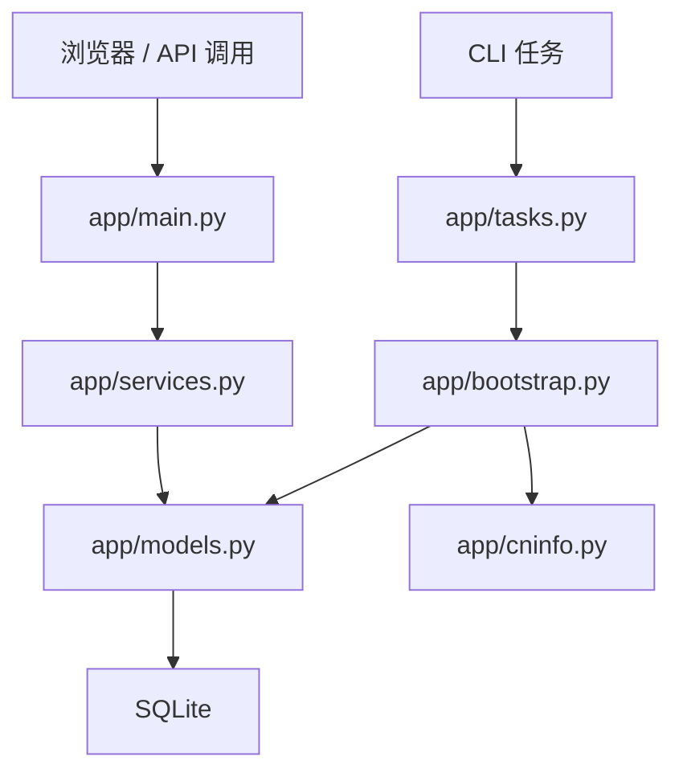

# 代码走读

## 1. 这份文档怎么用

如果你是第一次接手这个项目，不要先扎进 ORM 字段细节。  
更高效的顺序是：

1. 先看入口和页面
2. 再看查询层
3. 再看同步层
4. 最后再看模型和归一规则

这份文档就是按这个顺序来讲。

## 2. 当前代码目录结构

```text
app/
  config.py
  db.py
  models.py
  schemas.py
  normalization.py
  cninfo.py
  bootstrap.py
  services.py
  main.py
  tasks.py
  templates/
  static/
docs/
data/
README.md
```

这些文件分别负责：

- `config.py`：配置和路径
- `db.py`：数据库连接与 session
- `models.py`：ORM 模型
- `schemas.py`：API 输出结构
- `normalization.py`：角色与事件标签归一
- `cninfo.py`：巨潮接口访问
- `bootstrap.py`：公司全集初始化与当前高管同步
- `services.py`：查询聚合层
- `main.py`：FastAPI 路由入口
- `tasks.py`：CLI 任务入口
- `templates/`：Jinja2 模板
- `static/`：CSS

## 3. 整体调用关系



当前代码核心上只有两条主线：

- 查询主线：`main.py -> services.py -> models.py`
- 同步主线：`tasks.py -> bootstrap.py -> cninfo.py -> models.py`

理解这两条主线，整个项目就不会散。

## 4. Web 入口：`app/main.py`

`main.py` 是整个 Web 应用入口。

它负责：

- 创建 FastAPI 应用
- 挂载静态资源目录
- 注册模板目录
- 在启动时建表并尝试初始化公司全集
- 定义页面路由
- 定义 API 路由

### 当前主要页面路由

- `/`：概览页
- `/coverage`：覆盖台账
- `/companies`：公司库
- `/people`：人物库
- `/companies/{ticker}`：公司详情
- `/people/{person_id}`：人物详情

### 当前主要 API 路由

- `/api/overview`
- `/api/baseline/summary`
- `/api/coverage`
- `/api/companies`
- `/api/companies/{ticker}`
- `/api/people`
- `/api/people/{person_id}`
- `/api/events`
- `/api/rankings/churn`

### 路由层边界

当前路由层比较干净，它只做：

- 接收参数
- 调 service
- 返回模板或 schema

它不应该做：

- 直接写复杂 SQL
- 直接调用外部接口
- 在页面函数里拼复杂业务逻辑

## 5. 查询层：`app/services.py`

`services.py` 是当前项目最重要的查询中枢。

它的职责不是采集数据，而是把底层表拼成：

- 页面可以直接用的数据
- API 可以直接返回的数据

### 为什么它最关键

现在产品入口已经不止首页，而是：

- 首页
- 覆盖台账
- 公司库
- 人物库
- 公司详情页
- 人物详情页

如果查询逻辑不集中在这里，后面会越来越乱。

### 当前最重要的函数

#### `get_baseline_summary`

职责：

- 统计公司总数
- 统计活跃公司
- 统计已同步 / 未同步公司
- 统计当前快照条数
- 返回最近同步任务状态

#### `get_overview`

职责：

- 聚合首页的总体信息
- 读取最近事件
- 读取变动榜占位信息
- 嵌入 baseline summary

#### `search_companies`

职责：

- 按关键词检索公司
- 按交易所筛选
- 按同步状态筛选
- 返回公司库页面和 `/api/companies`

#### `search_people`

职责：

- 按姓名检索人物
- 按角色筛选
- 支持只看当前活跃任职或包含历史任职
- 返回人物库页面和 `/api/people`

#### `get_coverage_dashboard`

职责：

- 汇总总体覆盖率
- 汇总同步状态分布
- 汇总交易所覆盖
- 汇总板块覆盖
- 汇总核心角色覆盖
- 汇总最近同步任务
- 列出待同步公司

#### `get_company_detail`

职责：

- 组装公司详情页所需的全部数据

它会读取：

- `companies`
- `company_metrics_daily`
- `role_tenures`
- `executive_snapshots`
- `events`

然后组装成 `CompanyDetailOut`。

#### `get_person_detail`

职责：

- 组装人物详情页所需的全部数据

它会读取：

- `persons`
- `role_tenures`
- `events`

最后拆成：

- 当前任职
- 任职历史
- 近期事件

## 6. 输出结构层：`app/schemas.py`

`schemas.py` 定义的是“接口怎么出”，不是“数据库怎么存”。

当前这层分为三类。

### 6.1 详情结构

- `CompanyDetailOut`
- `PersonDetailOut`
- `ExecutiveSnapshotOut`
- `CompanyTenureOut`
- `PersonTenureOut`

### 6.2 概览与台账结构

- `BaselineSummaryOut`
- `OverviewOut`
- `CoverageDashboardOut`
- `BaselineRunOut`
- `StatusBreakdownItemOut`
- `CoverageBucketOut`
- `RoleCoverageItemOut`

### 6.3 检索结构

- `CompanyListItemOut`
- `CompanySearchOut`
- `PersonListItemOut`
- `PersonSearchOut`

### 为什么不能省掉 schema 层

如果直接把 ORM 对象往外丢，会马上带来几个问题：

- 页面和 API 直接耦合数据库字段
- 后续字段调整很痛
- 难以保证返回结构稳定

所以 schema 层必须保留。

## 7. 同步层：`app/bootstrap.py`

`bootstrap.py` 是数据进入系统的主入口。

它承担两个大任务：

- 初始化公司全集
- 同步当前高管基线

### 7.1 `ensure_company_universe`

职责：

- 如果库里还没有公司数据，就从巨潮证券清单拉一遍
- 建立上市公司全集

### 7.2 `upsert_company_from_stock_entry`

职责：

- 把证券清单里的单家公司写进 `companies`
- 推断交易所、板块和来源链接

### 7.3 `_upsert_person`

职责：

- 用巨潮返回的人物信息更新或创建 `Person`

当前规则：

- 优先按 `external_person_id` 去重
- 更新姓名、性别、出生年、学历

### 7.4 `_apply_company_payload`

这是当前同步链路里最关键的函数。

它会：

1. 解析公司简介
2. 更新 `companies`
3. 删除旧的 `executive_snapshots`
4. 删除旧的推导型 `role_tenures`
5. 遍历当前高管列表
6. upsert 人物
7. 归一角色
8. 写入新的当前快照
9. 写入新的活跃任职区间占位

当前它还多了一层容错：

- 如果巨潮某些字段返回 `null`
- 不会因为直接遍历 `None` 把整家公司同步打崩
- 会尽量把能落库的部分先落进去

你可以把它理解成：

**把某家公司的“当前治理状态”完整地重建到数据库。**

### 7.5 `sync_company_baseline`

职责：

- 调度一批公司同步
- 用线程池并发抓取
- 记录同步成功/失败情况
- 更新 `baseline_runs`

当前策略：

- 优先同步还没同步过的公司
- 支持 `--limit`
- 支持 `--workers`

## 8. 数据接入层：`app/cninfo.py`

`cninfo.py` 的职责非常单纯：

- 请求巨潮接口
- 返回解析后的 JSON

### 当前最关键的函数

#### `_request_json`

职责：

- 发 HTTP 请求
- 带上伪装请求头
- 在网络抖动、远端强制断开、超时等情况下自动重试
- 按退避节奏等待后再试
- 返回 JSON

这是所有巨潮请求的基础。

#### `fetch_stock_universe`

职责：

- 拉证券清单
- 过滤出 A 股
- 组装成 `StockListEntry`

#### `fetch_company_introduction`

职责：

- 拉单个公司的简介信息

#### `fetch_company_executives`

职责：

- 拉单个公司的当前高管列表

#### `infer_exchange` / `normalize_market_segment`

职责：

- 根据证券代码推断交易所和板块

## 9. 归一层：`app/normalization.py`

`normalization.py` 是当前准确性最敏感的文件之一。

它负责：

- 角色标签映射
- 事件标签映射
- 角色优先级
- 从原始职务文本里提取标准角色

当前项目能不能把“董事长、总经理、财务负责人、董事、独立董事”分干净，很大程度取决于这里。

### 当前特别重要的一点

CEO 等价角色映射已经收紧，不会把所有带“总经理”的词都强行卷进去。  
这能显著减少基线层污染。

## 10. 数据模型层：`app/models.py`

当前最关键的模型是：

- `Company`
- `Person`
- `ExecutiveSnapshot`
- `RoleTenure`
- `BaselineRun`

已经预留但还没有真正形成业务闭环的模型是：

- `SourceDocument`
- `Event`
- `CompanyMetricDaily`

这说明系统设计已经为后续事件流和指标层留好了坑位。

## 11. CLI 层：`app/tasks.py`

`tasks.py` 是命令行入口。

它现在提供两个主命令：

- `init-universe`
- `sync-baseline`

它负责：

- 解析参数
- 可选重建数据库
- 调起 `bootstrap.py`

虽然现在还轻，但已经足够支撑本地持续迭代。

## 12. 模板层：`app/templates/*`

当前模板已经不是最初的 3 个页面。

### 当前模板列表

- `base.html`
- `index.html`
- `coverage.html`
- `companies.html`
- `people_list.html`
- `company.html`
- `person.html`

### 模板层职责

模板只负责：

- 布局
- 条件显示
- 列表渲染

模板不负责：

- 数据查询
- 角色归一
- 统计计算

也就是说，模板层应该一直保持“笨”。

## 13. 样式层：`app/static/styles.css`

当前样式文件主要负责统一产品骨架：

- 顶部导航
- Hero 区
- 面板样式
- 台账表格
- 筛选表单
- 统计卡片
- 列表卡片

这次升级后，它已经开始承担“产品系统风格”的职责，而不只是给首页补点颜色。

## 14. 当前最值得重点盯的文件

后续如果继续扩展，最值得重点关注的是：

- `app/bootstrap.py`
- `app/normalization.py`
- `app/services.py`
- `app/main.py`

原因分别是：

- `bootstrap.py` 决定同步质量
- `normalization.py` 决定数据准确性
- `services.py` 决定查询层是否失控
- `main.py` 决定产品入口是否清晰

## 15. 推荐阅读顺序

建议按下面顺序读：

1. `README.md`
2. `docs/system-overview.md`
3. `app/main.py`
4. `app/services.py`
5. `app/bootstrap.py`
6. `app/cninfo.py`
7. `app/models.py`
8. `app/normalization.py`
9. `app/tasks.py`
10. `app/templates/*`

## 16. 一句话总结

当前代码已经不是“脚本堆”，而是一个清晰分层的小型 Web 数据产品：

- `cninfo.py` 接数据
- `bootstrap.py` 编排同步
- `models.py` 存结构
- `services.py` 组查询
- `main.py` 暴露页面和 API

这就是你接手这套代码时最重要的结构认知。
