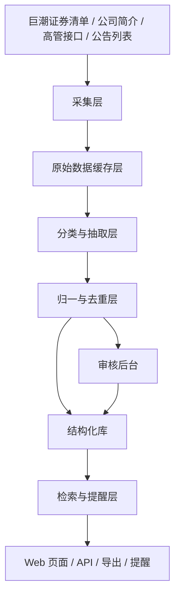

# 第一阶段产品规划与技术路线

## 1. 阶段一的目标

阶段一不是要把项目做成“完整的上市公司治理情报平台”，而是要做成：

**一个可以卖给猎头 / 董事会搜寻顾问的“上市公司高管异动雷达”最小可收费产品。**

阶段一的目标只有 3 个：

1. 让目标客户愿意试用
2. 让目标客户每天愿意打开
3. 让目标客户愿意为“提醒 + 检索 + 导出”付钱

这意味着阶段一不是技术炫技阶段，而是：

**把一个明确工作流做完整的阶段。**

## 2. 阶段一的商业定义

### 2.1 一句话产品定义

帮助猎头、董事会搜寻顾问和高端人才咨询团队，实时发现中国上市公司 CEO / CFO / 董事长 / 董事 / 独立董事的变动，并快速形成可执行候选名单。

### 2.2 目标客户

第一阶段只服务第一类用户：

- 猎头顾问
- 董事会搜寻顾问
- 高端人才咨询团队

暂时不优先服务：

- 散户
- 普通财经资讯用户
- 大型投研终端用户
- 企业 IR / 董办采购团队

### 2.3 他们愿意付费的原因

他们不是为“数据库”付费，而是为这 4 件事付费：

1. 更早知道谁离职了
2. 更快知道谁刚上任
3. 更快知道这个人之前在哪
4. 更快导出一个候选名单

## 3. 阶段一的产品承诺

阶段一对用户承诺的不是“全市场最强平台”，而是：

### 核心承诺

- 每天帮你盯住 A 股核心高管与董事异动
- 帮你把分散公告变成可查、可筛、可导出的结构化名单
- 帮你更快做出搜寻项目的第一版候选池

### 不承诺的事

- 不承诺替代 Wind
- 不承诺全金融数据覆盖
- 不承诺完美图谱
- 不承诺覆盖所有岗位和所有资本市场

## 4. 阶段一的范围冻结

这是阶段一必须锁死的边界。

### 4.1 市场范围

- 只做 A 股
- 覆盖沪市、深市、北交所
- 不做港股
- 不做美股中概

### 4.2 角色范围

- 董事长
- 总经理 / 总裁 / CEO 等价角色
- CFO / 财务负责人 / 财务总监
- 董事
- 独立董事

### 4.3 事件范围

- 任命
- 辞职
- 离任
- 换届连任
- 代行职责
- 提名通过但未生效

### 4.4 第一阶段必须有的功能

1. 今日 / 本周异动流
2. 公司检索
3. 人物检索
4. 公司详情页
5. 人物详情页
6. 自定义关注列表
7. 邮件 / 企业微信异动提醒
8. 条件筛选与 CSV 导出
9. 覆盖台账与数据可信度展示
10. 后台审核队列

### 4.5 第一阶段明确不做

- 董事会复杂关系图首页
- 行业宏观分析
- 财务报表终端
- 大规模权限体系
- 多租户复杂组织结构
- 复杂 BI 报表中心
- API 对外商业开放

## 5. 阶段一的用户工作流

阶段一不是按“功能列表”设计，而是按用户工作流设计。

### 工作流 A：猎头顾问发现离任机会

1. 打开今日 / 本周异动流
2. 筛选“CFO / 总经理 / 董事长”
3. 看离任、辞任、换届相关事件
4. 进入人物页看此人过往轨迹
5. 进入公司页看当前领导层和历史变动
6. 把命中的名单导出

### 工作流 B：顾问做某行业搜寻项目

1. 搜索行业或公司集合
2. 筛出过去 90 天某类角色变动
3. 查看相关人物历史任职
4. 选择关注名单
5. 导出候选清单

### 工作流 C：长期监控重点公司

1. 把公司加入关注列表
2. 订阅每日 / 即时提醒
3. 收到异动后直接进入对应公司与人物页面
4. 判断是否要跟进项目

## 6. 阶段一的信息架构

### 6.1 首页

模块：

- 今日异动
- 本周异动
- 热门角色异动
- 快速筛选入口
- 我的关注摘要

### 6.2 异动流页

模块：

- 时间范围筛选
- 角色筛选
- 事件类型筛选
- 行业筛选
- 公司筛选
- 导出按钮

### 6.3 公司页

模块：

- 公司基本信息
- 当前领导层快照
- 历史异动时间线
- 同角色历史变化
- 关注按钮

### 6.4 人物页

模块：

- 当前任职
- 历史任职
- 最近异动
- 涉及公司
- 导出到名单

### 6.5 检索页

分为：

- 公司库
- 人物库

### 6.6 关注页

模块：

- 我关注的公司
- 我关注的人
- 最近提醒
- 提醒配置

### 6.7 审核后台

模块：

- 低置信度事件队列
- 待审核人物归一
- 失败同步队列
- 手工重跑入口

## 7. 阶段一的产品模块划分

阶段一建议拆成 7 个模块。

### 模块 1：基线库

职责：

- 公司全集
- 当前领导层快照
- 当前人物库

当前状态：

- 已有基础

阶段一目标：

- 基本完成活跃 A 股的当前快照覆盖

### 模块 2：公告事件流

职责：

- 抓公告
- 识别人事相关公告
- 抽取结构化事件

阶段一目标：

- 让“异动流”变成真实主功能，而不是占位

### 模块 3：检索与详情

职责：

- 公司检索
- 人物检索
- 公司详情
- 人物详情

当前状态：

- 已有部分页面

阶段一目标：

- 让它们真正支撑实际业务检索

### 模块 4：导出与名单

职责：

- 条件筛选
- CSV 导出
- 候选名单保存

阶段一目标：

- 让用户完成“搜到人 -> 带走名单”闭环

### 模块 5：关注与提醒

职责：

- 关注公司
- 关注人物
- 关注角色
- 日报 / 实时提醒

阶段一目标：

- 让用户形成复访和长期依赖

### 模块 6：审核与运维

职责：

- 查看低置信度事件
- 查看失败同步
- 人工修正

阶段一目标：

- 让数据质量能被运营

### 模块 7：可信度与覆盖感知

职责：

- 覆盖率
- 最近同步状态
- 数据来源和证据片段

阶段一目标：

- 让用户相信数据

## 8. 阶段一的技术路线

技术路线必须服务产品工作流，不能为了架构而架构。

### 8.1 总体技术方向

阶段一采用：

- Python + FastAPI
- SQLAlchemy
- SQLite 先跑通，再预留迁移 PostgreSQL 的路径
- Jinja2 服务端渲染先落地
- 后台任务以 CLI/定时脚本为主

原因：

- 当前工程已经是这条栈
- 单人开发成本最低
- 可以先把真实工作流做出来

### 8.2 系统分层

### 8.3 阶段一必须落地的技术模块

#### 技术模块 A：公司与人物基线同步

职责：

- 持续补齐当前快照覆盖
- 修复失败公司
- 提供同步状态追踪

现状：

- 已有基础实现

阶段一要补：

- 失败分类
- 批量重试
- 覆盖率统计

#### 技术模块 B：公告抓取器

职责：

- 拉取巨潮公告列表
- 过滤管理层相关公告
- 缓存原始正文 / 链接 / 时间戳

阶段一建议实现方式：

- 先做列表抓取
- 再做正文缓存
- 保留 `source_document` 原始层

#### 技术模块 C：事件抽取器

职责：

- 从公告中抽取结构化事件

阶段一建议路线：

1. 标题规则筛候选
2. 正文规则切段
3. 结构化抽取
4. 角色归一
5. 证据片段回写

阶段一不要走纯 LLM 黑箱。  
要坚持：

- 规则预筛
- 结构化输出
- 证据留存

#### 技术模块 D：事件去重器

职责：

- 合并同一事件的多个公告表达
- 处理董事会决议、股东大会决议、正式公告之间的重复

#### 技术模块 E：搜索与导出层

职责：

- 支持高效筛选
- 支持导出 CSV

实现建议：

- 阶段一先用数据库筛选
- 后续数据量再上来再考虑全文检索引擎

#### 技术模块 F：提醒任务

职责：

- 生成日报
- 发送即时提醒

阶段一建议：

- 先做邮件
- 再接企业微信机器人

#### 技术模块 G：审核后台

职责：

- 人工修订低置信度事件
- 人工重跑失败公司

## 9. 阶段一的数据模型增量

当前系统已经有：

- `companies`
- `persons`
- `executive_snapshots`
- `role_tenures`
- `baseline_runs`
- `events`
- `source_documents`

阶段一需要把这些真正用起来，并建议新增以下逻辑实体：

### 9.1 `watchlists`

用途：

- 存用户关注公司 / 人物 / 角色

核心字段：

- `id`
- `user_id`
- `target_type`
- `target_id`
- `created_at`

### 9.2 `alerts`

用途：

- 存提醒记录

核心字段：

- `id`
- `user_id`
- `event_id`
- `delivery_channel`
- `delivery_status`
- `sent_at`

### 9.3 `review_queue`

用途：

- 存低置信度事件与人工修订项

核心字段：

- `id`
- `queue_type`
- `target_id`
- `status`
- `reason`
- `assigned_to`
- `resolved_at`

### 9.4 `saved_lists`

用途：

- 存导出的候选名单或人工保存名单

核心字段：

- `id`
- `user_id`
- `name`
- `filters_json`
- `created_at`

## 10. 阶段一的 API 规划

阶段一建议的核心 API：

### 异动流

- `GET /api/feed/events`
- `GET /api/feed/events/{id}`

### 公司

- `GET /api/companies`
- `GET /api/companies/{ticker}`

### 人物

- `GET /api/people`
- `GET /api/people/{id}`

### 关注与提醒

- `GET /api/watchlists`
- `POST /api/watchlists`
- `DELETE /api/watchlists/{id}`
- `GET /api/alerts`

### 导出

- `POST /api/exports/events`
- `POST /api/exports/people`

### 审核后台

- `GET /api/review/queue`
- `POST /api/review/queue/{id}/approve`
- `POST /api/review/queue/{id}/reject`
- `POST /api/review/retry-company/{ticker}`

## 11. 阶段一的页面规划

### 页面 1：异动雷达首页

目标：

- 打开就看到价值

必须展示：

- 今日离任
- 今日任命
- 本周重点异动
- 关注对象变化

### 页面 2：异动流页

目标：

- 满足“看全量 + 做筛选 + 导出”

### 页面 3：公司页

目标：

- 回答“这家公司现在是谁在任、最近发生了什么变化”

### 页面 4：人物页

目标：

- 回答“这个人是谁、在哪里任过职、最近有什么变化”

### 页面 5：关注页

目标：

- 让用户形成日常使用

### 页面 6：审核后台

目标：

- 让系统不是纯自动黑盒

## 12. 阶段一的运营与数据质量要求

阶段一必须把这些质量指标当成硬指标。

### 覆盖指标

- 活跃 A 股公司当前快照覆盖率
- 目标角色覆盖率
- 最近 7 天事件覆盖率

### 准确性指标

- 人名准确率
- 角色归一准确率
- 事件类型准确率
- 日期抽取准确率

### 运行指标

- 公告抓取成功率
- 同步失败率
- 单批处理时长
- 提醒发送成功率

### 用户指标

- 每周活跃用户
- 每日打开率
- 导出使用率
- 关注列表使用率

## 13. 阶段一的研发节奏

阶段一建议按 6 个里程碑推进。

### 里程碑 1：基线层收尾

交付：

- 当前快照覆盖基本补齐
- 失败公司分类
- 覆盖台账稳定可用

### 里程碑 2：公告原始层

交付：

- 公告列表抓取
- `source_documents` 落库
- 原始正文缓存

### 里程碑 3：事件抽取层

交付：

- 事件分类
- 结构化事件落库
- 证据片段回写

### 里程碑 4：产品主工作流

交付：

- 异动流页
- 详情页接事件流
- 导出功能

### 里程碑 5：关注与提醒

交付：

- 关注列表
- 邮件提醒
- 企业微信提醒

### 里程碑 6：审核与交付准备

交付：

- 审核后台
- 失败重试入口
- 第一版销售演示环境

## 14. 阶段一建议的时间预算

如果按个人开发者节奏，我建议按下面的现实预算来做：

- 第 1-2 周：基线收尾 + 同步治理
- 第 3-4 周：公告抓取 + 原始层 + 抽取原型
- 第 5-6 周：异动流页 + 导出
- 第 7 周：关注与提醒
- 第 8 周：审核后台 + 演示打磨

也就是说：

**8 周左右可以做出第一版可卖产品。**

## 15. 阶段一的验收标准

如果阶段一完成，应该能满足下面这些判断标准。

### 产品验收

- 用户能在首页看到当天异动
- 用户能筛出某类角色异动
- 用户能进入公司页和人物页查看详情
- 用户能导出候选名单
- 用户能关注公司或人物并收到提醒

### 技术验收

- 公告能稳定抓取
- 事件能结构化落库
- 同步失败可追踪
- 低置信度事件可人工审核

### 商业验收

- 你能拿这套产品做真实演示
- 你能把输出结果发给 5-10 个潜在客户
- 你能收集到第一轮明确付费反馈

## 16. 阶段一最重要的取舍

阶段一最重要的不是“多做功能”，而是守住下面 4 个取舍：

1. 守住目标客户：只服务猎头 / 搜寻顾问
2. 守住工作流：提醒、检索、导出优先
3. 守住数据可信：每条事件都保留来源和证据
4. 守住范围边界：不做大而全平台

## 17. 阶段一的最终定义

如果把阶段一压缩成一句话，它应该是：

**一个面向猎头与董事会搜寻顾问的 A 股高管异动雷达产品，核心价值是“更早发现异动、更快完成人物检索、更快导出候选名单”。**
