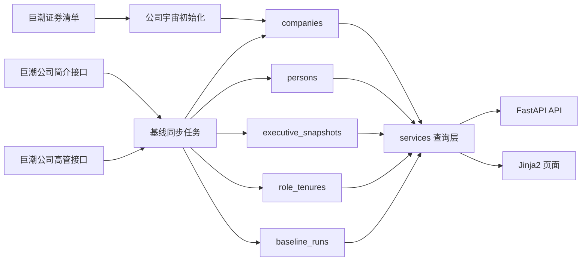
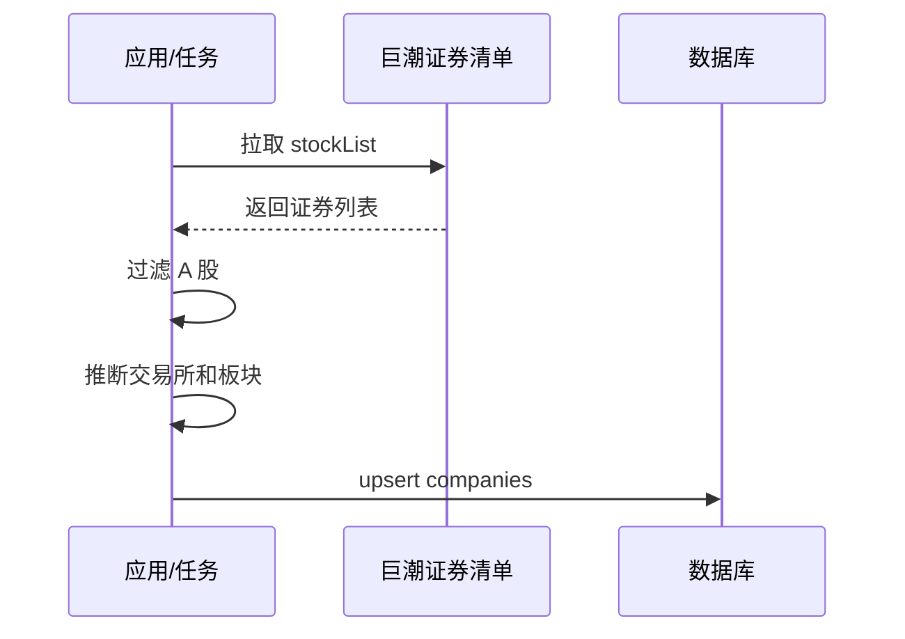
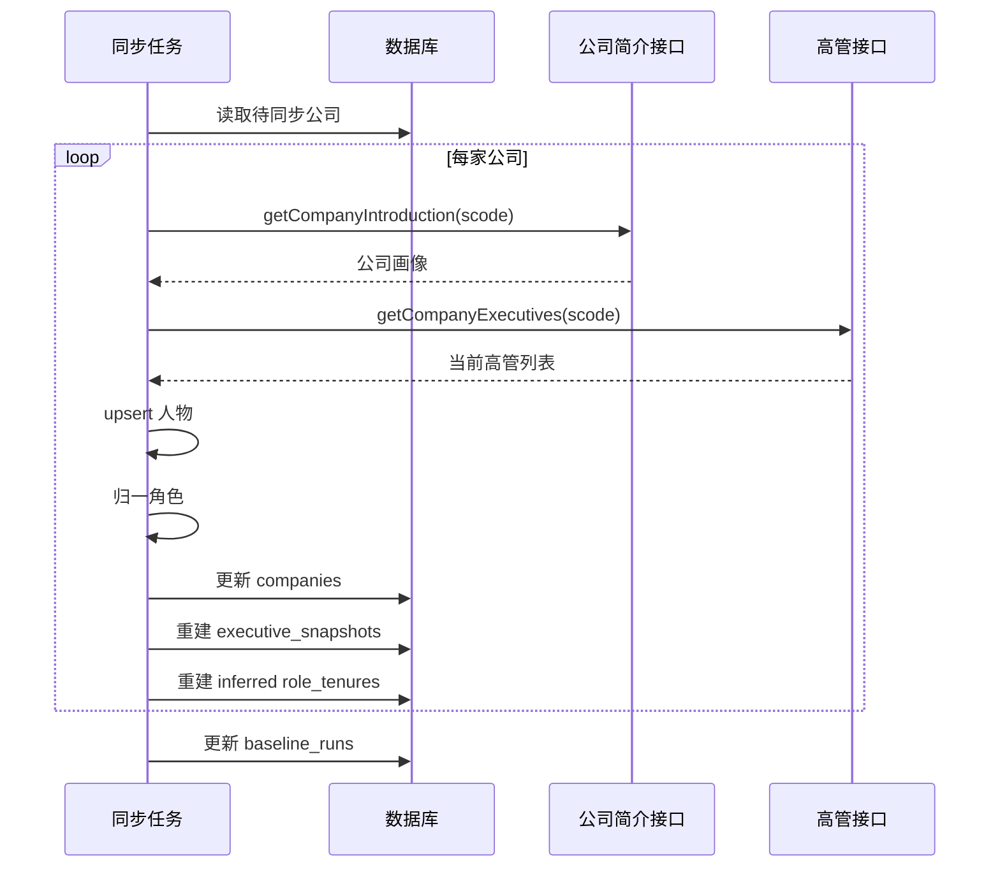

# 中国上市公司高管与董事会变动追踪

## 1. 这份文档是干什么的

这份文档不是宣传稿，而是项目总览。  
它回答 4 个核心问题：

- 当前系统到底在做什么
- 现在已经实现到了哪一层
- 页面、接口、数据库、同步任务之间怎么协作
- 后续扩展时，应该沿着什么架构继续长

## 2. 当前系统的真实定位

当前项目还不是完整的“上市公司高管变动情报平台”，它现在最准确的定位是：

**一个面向中国 A 股的“当前高管基线库产品底座”。**

也就是说，当前系统优先做的是：

- 建立 A 股上市公司全集
- 同步公司简介
- 同步当前高管与董事会核心角色快照
- 把人物、公司、角色关系落成结构化数据
- 提供覆盖台账、公司库、人物库和详情页

它暂时还不是：

- 全量公告事件流系统
- 全量治理指标系统
- 完整人物流动图谱系统

## 3. 为什么当前必须先做“基线库”

如果没有“当前高管基线”，后面的很多能力都会漂：

- 事件流无法判断某条公告是新增、离任还是换届连任
- 任职区间无法闭合
- 公司页无法回答“现在这家公司是谁在任”
- 人物页无法区分“当前任职”和“历史任职”
- 稳定度评分、同比、环比都没有参照物

所以当前系统的建设顺序被固定为：

1. 公司全集
2. 当前高管基线
3. 任职区间基础层
4. 事件流
5. 指标层
6. 图谱与预警

## 4. 当前角色范围

当前版本只做核心角色：

- 董事长
- 总经理 / 总裁 / CEO 等价角色
- 财务负责人 / 财务总监 / CFO 等价角色
- 董事
- 独立董事

这是一种有意识的收口。原因是：

- 这些角色业务意义最强
- 巨潮接口里信号密度更高
- 页面更容易解释
- 后续事件流更容易和当前基线对齐

## 5. 当前数据源

当前接入的数据全部来自巨潮官方公开接口：

- 证券清单：`https://www.cninfo.com.cn/new/data/szse_stock.json`
- 公司简介：`/data20/companyOverview/getCompanyIntroduction`
- 公司高管：`/data20/companyOverview/getCompanyExecutives`

这 3 个接口分别负责：

- 公司宇宙
- 公司基础画像
- 当前高管快照

## 6. 当前已经实现的能力

### 6.1 数据层

已经实现：

- 公司主表
- 人物主表
- 当前高管快照表
- 任职区间表
- 同步运行记录表

已经预留但尚未正式启用：

- 原始公告表
- 事件表
- 公司指标表

### 6.2 同步层

已经实现：

- 上市公司全集初始化
- 公司简介同步
- 当前高管同步
- 请求重试与退避，减轻远端断连接导致的大面积中断
- 角色归一
- 同步失败记录

尚未实现：

- 增量调度
- 失败分类
- 事件流采集

### 6.3 产品层

已经实现的页面：

- `/` 概览页
- `/coverage` 覆盖台账
- `/companies` 公司库
- `/people` 人物库
- `/companies/{ticker}` 公司详情页
- `/people/{person_id}` 人物详情页

已经实现的 API：

- `/api/overview`
- `/api/baseline/summary`
- `/api/coverage`
- `/api/companies`
- `/api/companies/{ticker}`
- `/api/people`
- `/api/people/{person_id}`
- `/api/events`
- `/api/rankings/churn`

## 7. 当前本地系统状态

截至当前这份工作区，本地数据库状态是：

- 公司总数：6099
- 活跃公司：5952
- 已同步公司：5031
- 未同步公司：921
- 当前快照条数：50105
- 核心角色快照条数：50105
- 人物数：54512

这说明：

- 公司全集层已经搭好
- 当前高管基线层已经可用
- 但覆盖率还远没有到全量生产级

## 8. 系统总体架构

整个系统可以分成 5 层。

### 8.1 基础设施层

职责：

- 配置读取
- 数据库连接
- Session 管理

对应文件：

- `app/config.py`
- `app/db.py`

### 8.2 数据接入层

职责：

- 请求巨潮接口
- 解析 JSON 响应
- 构造公司来源链接
- 推断交易所和板块

对应文件：

- `app/cninfo.py`

### 8.3 业务编排层

职责：

- 初始化公司全集
- 同步公司画像和高管快照
- upsert 人物
- 重建当前快照
- 写入推导任职区间
- 记录同步运行状态

对应文件：

- `app/bootstrap.py`
- `app/tasks.py`

### 8.4 查询组装层

职责：

- 聚合概览数据
- 组装公司详情
- 组装人物详情
- 构造覆盖台账
- 构造公司库和人物库检索结果

对应文件：

- `app/services.py`
- `app/schemas.py`

### 8.5 展示层

职责：

- 提供页面路由
- 提供 JSON API
- 提供模板和样式

对应文件：

- `app/main.py`
- `app/templates/*`
- `app/static/styles.css`

## 9. 关键业务流程

### 9.1 应用启动流程

应用启动时会做这几件事：

1. 创建 `data` 目录
2. 创建数据库表
3. 尝试初始化公司全集
4. 即使公司全集初始化失败，也不阻塞 Web 服务启动

这样设计的原因是：

- Web 服务优先可用
- 外部数据源短暂失败时，不应该让整个站点打不开

### 9.2 公司全集初始化流程

初始化的核心结果是建立 `companies` 这张根表。

### 9.3 当前高管基线同步流程

几个关键点：

- 同步是按公司维度做的，不是按人物维度
- 每次同步某家公司时，会删除该公司的旧快照，再写入新快照
- `role_tenures` 当前还是“基线推导层”，不是最终的人事真相层

### 9.4 页面查询流程

概览页：

- 调用 `get_overview`
- 显示总体规模、最近事件、最近同步公司、指标占位信息

覆盖台账：

- 调用 `get_coverage_dashboard`
- 显示总体覆盖率、状态分布、交易所覆盖、板块覆盖、核心角色覆盖、最近同步任务、待同步公司队列

公司库：

- 调用 `search_companies`
- 支持按关键词、交易所、同步状态过滤

人物库：

- 调用 `search_people`
- 支持按姓名、角色、活跃任职状态过滤

公司详情页：

- 读取公司主数据
- 读取当前快照
- 读取活跃任职区间
- 读取近期事件与指标

人物详情页：

- 读取人物主数据
- 读取当前任职
- 读取任职历史
- 读取近期事件

## 10. 核心数据模型解释

### 10.1 `companies`

作用：

- 系统根表
- 存放上市公司主数据

关键字段：

- `ticker`
- `exchange`
- `org_id`
- `company_name`
- `short_name`
- `industry_l1`
- `market_segment`
- `baseline_status`
- `baseline_last_synced_at`

### 10.2 `persons`

作用：

- 存放人物主数据

关键字段：

- `canonical_name`
- `external_person_id`
- `gender`
- `birth_year`
- `education`

当前人物去重策略：

- 优先依赖 `external_person_id`
- 暂不做复杂跨公司同名合并

### 10.3 `executive_snapshots`

作用：

- 表达“某天某家公司当前有哪些高管/董事角色”

为什么它是当前系统最重要的表：

- 它是“当前状态”的真相层
- 公司详情页、人物详情页和覆盖台账都依赖它
- 后续事件流和指标层也可以用它做校验

### 10.4 `role_tenures`

作用：

- 表达人物在公司中的任职区间

当前状态：

- 现在主要是推导出的“当前活跃任职”
- `start_date` 还大多为空
- 等事件流接入后，再反推出真实任期起止

### 10.5 `baseline_runs`

作用：

- 记录每次同步任务的运行情况

价值：

- 能知道当前覆盖进度
- 能看到失败公司数量
- 能审计同步执行结果

### 10.6 `events`

作用：

- 为下一阶段的人事事件流预留

当前状态：

- 表结构已经存在
- 页面和 API 也有承载位置
- 但公告抓取、分类、抽取、去重还没有真正落地

## 11. 当前最重要的设计决策

### 11.1 当前快照按公司整包重建，不做局部 patch

原因：

- 当前接口给的是完整当前列表，不是差异列表
- 全量重建逻辑更简单，脏数据风险更低

代价：

- 不是最省资源
- 不保留历史快照版本

### 11.2 `role_tenures` 允许开始日期为空

原因：

- 当前只有“当前状态”，没有正式事件流
- 如果硬填开始日期，只会制造假数据

### 11.3 CEO 等价角色映射规则做得更保守

当前不会把所有带“总经理”的词都强行映射成 CEO 等价。  
比如：

- 副总经理
- 常务副总经理
- 执行副总裁

这些不会被错误卷入 `ceo_equivalent`。

这样做的目的只有一个：

**先把基线层做干净。**

## 12. 当前页面信息结构

### 12.1 首页

包含：

- 总体规模
- 最近事件
- 30 日变动榜占位
- 最近同步公司样本

### 12.2 覆盖台账

包含：

- 总体覆盖率
- 状态分布
- 交易所覆盖
- 板块覆盖
- 核心角色覆盖
- 最近同步任务
- 待同步公司队列

### 12.3 公司库

包含：

- 公司检索
- 交易所筛选
- 同步状态筛选
- 当前快照条数
- 核心角色条数

### 12.4 人物库

包含：

- 人物检索
- 角色筛选
- 活跃任职筛选
- 当前任职摘要

### 12.5 公司详情页

包含：

- 公司画像
- 当前领导层快照
- 活跃任职区间
- 指标和事件区域

### 12.6 人物详情页

包含：

- 人物画像
- 当前任职
- 任职历史
- 近期事件

## 13. 当前系统的不足

下面这些不是 bug，而是阶段性缺失：

- 公告事件流还没有接进来
- 指标表还没有真实回填
- 图谱还没有开始
- 同步失败还没有自动重试
- 没有审核后台
- 没有订阅提醒
- 没有快照版本历史

## 14. 接下来应该怎么长

正确顺序已经固定：

1. 扩大当前高管基线覆盖率
2. 增加失败重试、失败分类、同步治理
3. 接入公告抓取与事件分类
4. 正式落 `events`
5. 反推真实任职区间
6. 生成 `company_metrics_daily`
7. 再做图谱、预警和订阅

## 15. 一句话总结

当前系统的本质是：

**一个基于巨潮官方数据的 A 股高管基线库产品底座，已经完成了“公司全集 + 当前高管快照 + 覆盖台账/公司库/人物库/详情页 + API”这一层，下一阶段应该在这个底座上接入公告事件流与指标层。**
